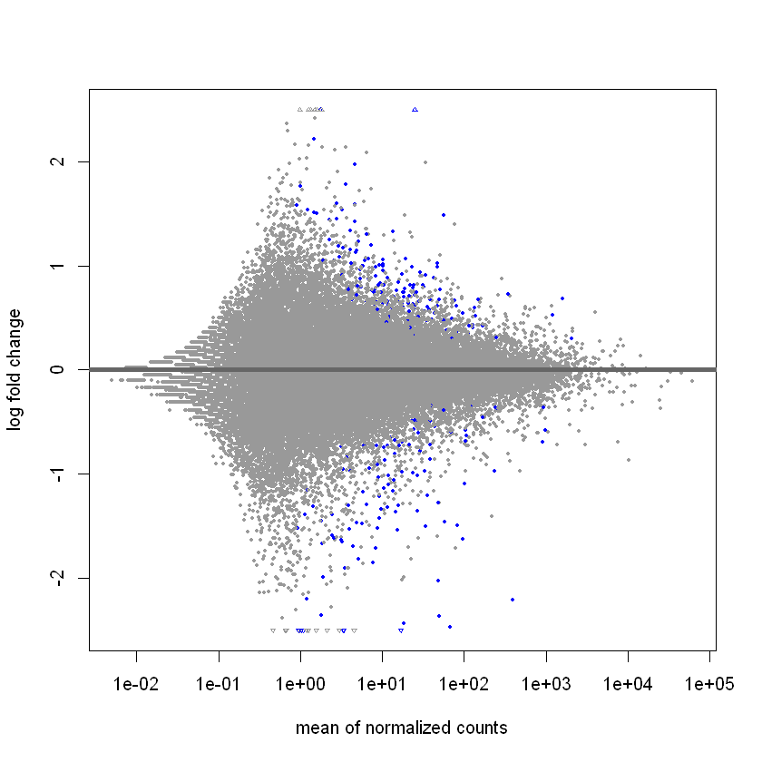
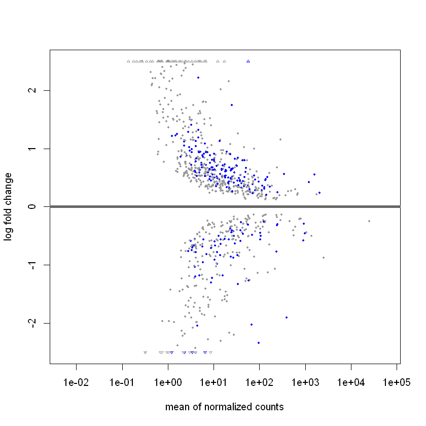
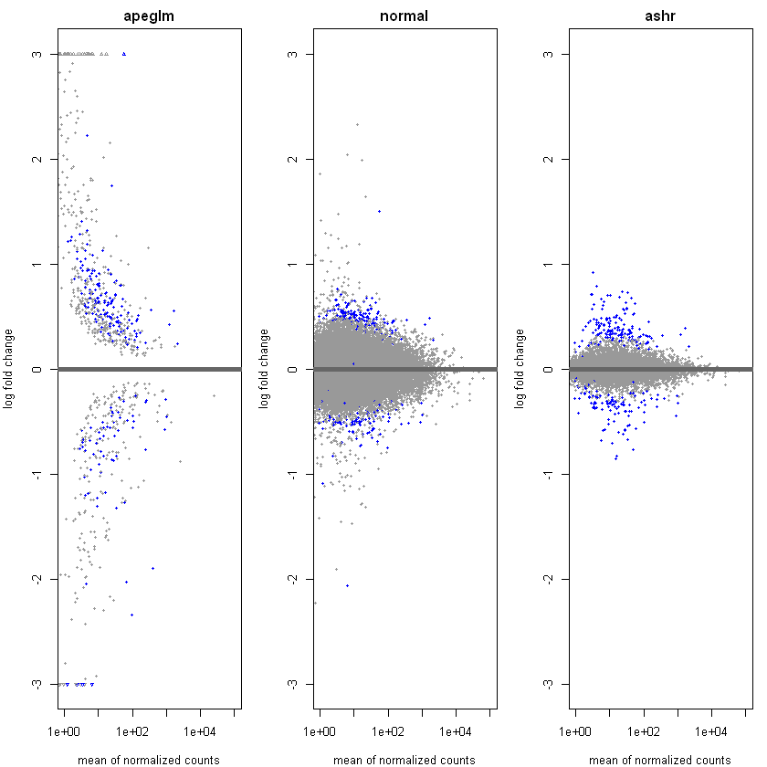
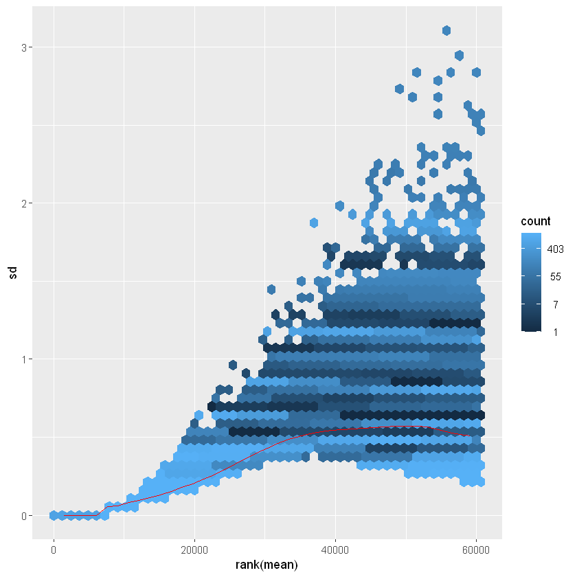
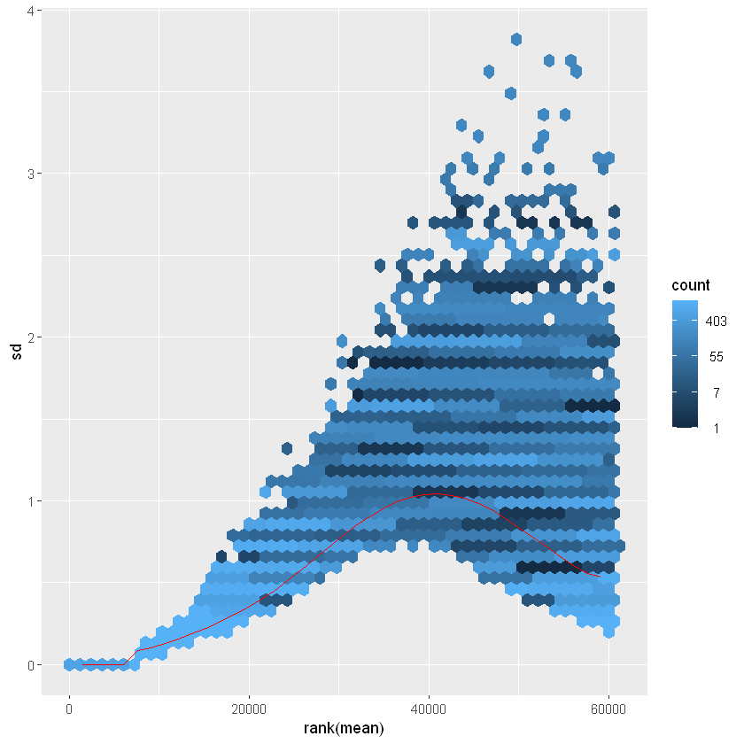
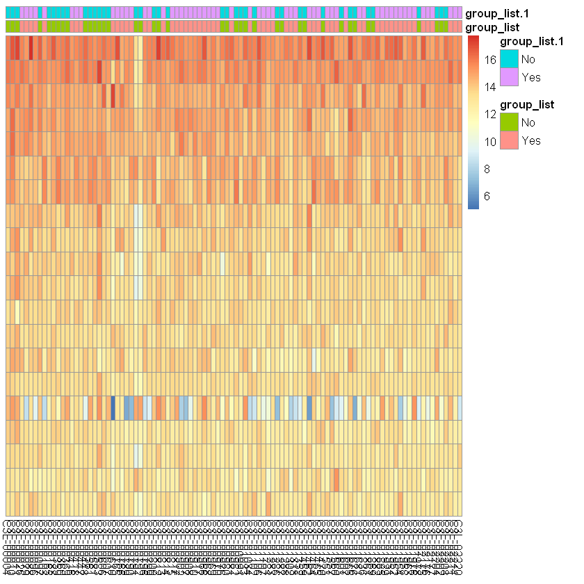

```R
library(DESeq2)
library(dplyr)
```

    Loading required package: S4Vectors
    
    Loading required package: stats4
    
    Loading required package: BiocGenerics
    
    
    Attaching package: 'BiocGenerics'
    
    
    The following objects are masked from 'package:stats':
    
        IQR, mad, sd, var, xtabs
    
    
    The following objects are masked from 'package:base':
    
        anyDuplicated, aperm, append, as.data.frame, basename, cbind,
        colnames, dirname, do.call, duplicated, eval, evalq, Filter, Find,
        get, grep, grepl, intersect, is.unsorted, lapply, Map, mapply,
        match, mget, order, paste, pmax, pmax.int, pmin, pmin.int,
        Position, rank, rbind, Reduce, rownames, sapply, setdiff, sort,
        table, tapply, union, unique, unsplit, which.max, which.min
    
    
    
    Attaching package: 'S4Vectors'
    
    
    The following objects are masked from 'package:base':
    
        expand.grid, I, unname
    
    
    Loading required package: IRanges
    
    
    Attaching package: 'IRanges'
    
    
    The following object is masked from 'package:grDevices':
    
        windows
    
    
    Loading required package: GenomicRanges
    
    Loading required package: GenomeInfoDb
    
    Loading required package: SummarizedExperiment
    
    Loading required package: MatrixGenerics
    
    Loading required package: matrixStats
    
    
    Attaching package: 'MatrixGenerics'
    
    
    The following objects are masked from 'package:matrixStats':
    
        colAlls, colAnyNAs, colAnys, colAvgsPerRowSet, colCollapse,
        colCounts, colCummaxs, colCummins, colCumprods, colCumsums,
        colDiffs, colIQRDiffs, colIQRs, colLogSumExps, colMadDiffs,
        colMads, colMaxs, colMeans2, colMedians, colMins, colOrderStats,
        colProds, colQuantiles, colRanges, colRanks, colSdDiffs, colSds,
        colSums2, colTabulates, colVarDiffs, colVars, colWeightedMads,
        colWeightedMeans, colWeightedMedians, colWeightedSds,
        colWeightedVars, rowAlls, rowAnyNAs, rowAnys, rowAvgsPerColSet,
        rowCollapse, rowCounts, rowCummaxs, rowCummins, rowCumprods,
        rowCumsums, rowDiffs, rowIQRDiffs, rowIQRs, rowLogSumExps,
        rowMadDiffs, rowMads, rowMaxs, rowMeans2, rowMedians, rowMins,
        rowOrderStats, rowProds, rowQuantiles, rowRanges, rowRanks,
        rowSdDiffs, rowSds, rowSums2, rowTabulates, rowVarDiffs, rowVars,
        rowWeightedMads, rowWeightedMeans, rowWeightedMedians,
        rowWeightedSds, rowWeightedVars
    
    
    Loading required package: Biobase
    
    Welcome to Bioconductor
    
        Vignettes contain introductory material; view with
        'browseVignettes()'. To cite Bioconductor, see
        'citation("Biobase")', and for packages 'citation("pkgname")'.
    
    
    
    Attaching package: 'Biobase'
    
    
    The following object is masked from 'package:MatrixGenerics':
    
        rowMedians
    
    
    The following objects are masked from 'package:matrixStats':
    
        anyMissing, rowMedians
    
    
    
    Attaching package: 'dplyr'
    
    
    The following object is masked from 'package:Biobase':
    
        combine
    
    
    The following object is masked from 'package:matrixStats':
    
        count
    
    
    The following objects are masked from 'package:GenomicRanges':
    
        intersect, setdiff, union
    
    
    The following object is masked from 'package:GenomeInfoDb':
    
        intersect
    
    
    The following objects are masked from 'package:IRanges':
    
        collapse, desc, intersect, setdiff, slice, union
    
    
    The following objects are masked from 'package:S4Vectors':
    
        first, intersect, rename, setdiff, setequal, union
    
    
    The following objects are masked from 'package:BiocGenerics':
    
        combine, intersect, setdiff, union
    
    
    The following objects are masked from 'package:stats':
    
        filter, lag
    
    
    The following objects are masked from 'package:base':
    
        intersect, setdiff, setequal, union
    
    
    

# This is the Final Project for Siqi Tao.

## Project Description
In this project, we will identify differentially expressed genes in Kidney Cancer \
Adenomas and Adenocarcinomas patients between alcohol drinkers and non-drinkers. \
This analysis will utilize the package DeSEQ2.

## Data Source
All clinical & RNA-Seq data is obtained from Project CPTAC-3. \
Please see https://portal.gdc.cancer.gov/projects/CPTAC-3 for more information. \
\
I have attached a manifest file "gdc_manifest.2022-11-28.txt" for re-downloading of data.

## Data Discription
In CPTAC-3 project, we can find 220 cases for Kidney Cancer. \
There are 461 files about Gene Expression Quantification. \
This redundance mainly originates from repeated experiments.

## Package Dependence
We will use R kernel for this project, \
Combined with DESeq2 package.

## Code starting from Here
========================================================================

### First, we will import MetaData information.
This metadata is very dirty and we must clean it up!

#### MetaData Part 1: File info
This is How we link file name with CaseID.


```R
metadata_raw = read.csv('./final/gdc_sample_sheet.2022-12-11.tsv',sep='\t')
```

extract only data from Primary Tumor!


```R
metadata <- metadata_raw[stringr::str_detect(metadata_raw$'Sample.Type','Primary Tumor'),]
```


```R
metadata_clean <- metadata %>% select('File.ID', 'File.Name', 'Case.ID', 'Sample.ID')
colnames(metadata_clean)[colnames(metadata_clean) == "Case.ID"] = 'case_submitter_id'
```


```R
metadata_clean
```


<table class="dataframe">
<caption>A data.frame: 312 × 4</caption>
<thead>
	<tr><th></th><th scope=col>File.ID</th><th scope=col>File.Name</th><th scope=col>case_submitter_id</th><th scope=col>Sample.ID</th></tr>
	<tr><th></th><th scope=col>&lt;chr&gt;</th><th scope=col>&lt;chr&gt;</th><th scope=col>&lt;chr&gt;</th><th scope=col>&lt;chr&gt;</th></tr>
</thead>
<tbody>
	<tr><th scope=row>3</th><td>b1283ef1-7172-4d22-993b-664ece47a81e</td><td>acad9b62-0a54-4678-87ef-b4c2fcfa2910.rna_seq.augmented_star_gene_counts.tsv</td><td>C3N-00646           </td><td>C3N-00646-01              </td></tr>
	<tr><th scope=row>4</th><td>1f02d75a-ff39-4984-bb49-62379969c77f</td><td>e7530ba4-3784-4bd7-92ba-4e58b397cff0.rna_seq.augmented_star_gene_counts.tsv</td><td>C3N-00317           </td><td>C3N-00317-02              </td></tr>
	<tr><th scope=row>5</th><td>fb075d69-0911-4dd9-bfa2-4daa8336a86f</td><td>acc85e4c-c313-4e7c-a209-f75ca4e7cc7a.rna_seq.augmented_star_gene_counts.tsv</td><td>C3L-01665           </td><td>C3L-01665-03              </td></tr>
	<tr><th scope=row>7</th><td>5b5cc4b1-90e1-4411-bc14-2ad13f2aa9da</td><td>699fa273-d966-46ef-9dc4-a5ee67608395.rna_seq.augmented_star_gene_counts.tsv</td><td>C3N-01361           </td><td>C3N-01361-01              </td></tr>
	<tr><th scope=row>8</th><td>070d8faa-9c6e-4a68-bc6b-e6333941232a</td><td>2c2a734b-33a2-499f-b364-ae77fca5abcc.rna_seq.augmented_star_gene_counts.tsv</td><td>C3N-00437           </td><td>C3N-00437-02              </td></tr>
	<tr><th scope=row>9</th><td>6bb9e61f-a72d-4e2a-925c-7c781a52eeb4</td><td>f9787b6f-960b-4923-b061-465e6937e2eb.rna_seq.augmented_star_gene_counts.tsv</td><td>C3N-00437           </td><td>C3N-00437-03              </td></tr>
	<tr><th scope=row>10</th><td>f178c76a-8401-46ec-bbcd-5e4ce20199e7</td><td>507541db-1414-4942-b386-b0d2bc245bee.rna_seq.augmented_star_gene_counts.tsv</td><td>C3N-00733           </td><td>C3N-00733-02              </td></tr>
	<tr><th scope=row>11</th><td>ce25fd85-7b64-4e38-a870-fabefb13aa34</td><td>75588feb-77f8-48ed-b759-1518687cbe08.rna_seq.augmented_star_gene_counts.tsv</td><td>C3N-00733           </td><td>C3N-00733-03              </td></tr>
	<tr><th scope=row>13</th><td>38e69d5c-8874-4892-b847-56775791d228</td><td>81817413-9a9e-4061-9b00-dde9a9c4db40.rna_seq.augmented_star_gene_counts.tsv</td><td>C3N-02723           </td><td>C3N-02723-01              </td></tr>
	<tr><th scope=row>14</th><td>04e474d6-06df-4bee-8e24-d2b82c623047</td><td>9695a2fd-3ce1-4fbf-924c-267664f14745.rna_seq.augmented_star_gene_counts.tsv</td><td>C3L-01885           </td><td>C3L-01885-03              </td></tr>
	<tr><th scope=row>15</th><td>e1f1f23b-8a51-4331-9823-f3d3d574349a</td><td>b338b489-1752-49a4-b02d-81ddbdf1d831.rna_seq.augmented_star_gene_counts.tsv</td><td>C3N-00832           </td><td>C3N-00832-01              </td></tr>
	<tr><th scope=row>16</th><td>653655cc-5f66-46c0-b6c9-a04a417a4c0d</td><td>0202da27-181a-45b1-94c1-4f8df450c90b.rna_seq.augmented_star_gene_counts.tsv</td><td>C3N-01078           </td><td>C3N-01078-02              </td></tr>
	<tr><th scope=row>19</th><td>60feefe9-a2f0-4593-8764-1101d7946098</td><td>98e4aa31-8aab-437c-b6d8-433100a0092b.rna_seq.augmented_star_gene_counts.tsv</td><td>C3N-00852           </td><td>C3N-00852-01              </td></tr>
	<tr><th scope=row>20</th><td>d45cc0a1-f678-4779-b229-b2f891199324</td><td>b38ff6d6-f797-416f-85e2-7185299cd005.rna_seq.augmented_star_gene_counts.tsv</td><td>C3N-02085, C3N-02085</td><td>C3N-02085-02, C3N-02085-01</td></tr>
	<tr><th scope=row>21</th><td>c3ef2c55-df84-4b45-a120-a1f00d526323</td><td>b081245e-3e29-42d5-8499-a0107a01341f.rna_seq.augmented_star_gene_counts.tsv</td><td>C3L-02176           </td><td>C3L-02176-01              </td></tr>
	<tr><th scope=row>23</th><td>36975150-8161-4eed-908c-ef80129dccd2</td><td>3fb71aeb-a66e-4b97-a09b-ca87673f4b36.rna_seq.augmented_star_gene_counts.tsv</td><td>C3L-02220           </td><td>C3L-02220-01              </td></tr>
	<tr><th scope=row>25</th><td>e3fca10d-7db2-466e-a36b-2b9068473cab</td><td>318459f6-f4b2-4b18-8591-4158b6220d40.rna_seq.augmented_star_gene_counts.tsv</td><td>C3L-01287           </td><td>C3L-01287-03              </td></tr>
	<tr><th scope=row>26</th><td>80601654-7caf-42f0-8074-8aca62d12d86</td><td>5d2a153b-b272-45ba-b46a-4afde3f6711f.rna_seq.augmented_star_gene_counts.tsv</td><td>C3N-00721           </td><td>C3N-00721-01              </td></tr>
	<tr><th scope=row>29</th><td>35fda1ff-87b0-405d-89e8-e09858665431</td><td>629b31b7-d654-4c42-a356-132904ed2a18.rna_seq.augmented_star_gene_counts.tsv</td><td>C3N-01989           </td><td>C3N-01989-02              </td></tr>
	<tr><th scope=row>30</th><td>89e44cb8-e015-478d-a13f-83686ea2c107</td><td>77e2a7e2-90f7-4262-8ea1-0332d9de7e8d.rna_seq.augmented_star_gene_counts.tsv</td><td>C3L-00097           </td><td>C3L-00097-01              </td></tr>
	<tr><th scope=row>32</th><td>9d1b8061-5732-4eef-b95e-fe49e7a50d9d</td><td>87873a4c-ed8b-4ebe-b917-d32dc7fdffc4.rna_seq.augmented_star_gene_counts.tsv</td><td>C3L-00360           </td><td>C3L-00360-01              </td></tr>
	<tr><th scope=row>34</th><td>86fa315e-a54f-444c-825c-fb85ba21b843</td><td>6711aa71-ad63-4539-bd60-2870e152ab98.rna_seq.augmented_star_gene_counts.tsv</td><td>C3N-00380           </td><td>C3N-00380-01              </td></tr>
	<tr><th scope=row>35</th><td>32fde02f-b550-4680-a2d5-32153097ff21</td><td>94940054-193e-4c21-9256-b93d9b48634d.rna_seq.augmented_star_gene_counts.tsv</td><td>C3N-00953           </td><td>C3N-00953-02              </td></tr>
	<tr><th scope=row>36</th><td>57354a0c-c9ab-4f4b-a29f-590cb395ef2c</td><td>d8c62a78-ff01-442a-bd93-4e4676f2c56b.rna_seq.augmented_star_gene_counts.tsv</td><td>C3N-00312           </td><td>C3N-00312-01              </td></tr>
	<tr><th scope=row>39</th><td>452fbcfd-a67b-43f3-a5db-e903b7562c74</td><td>17253872-c862-40bf-8f9b-b2cad690ccd8.rna_seq.augmented_star_gene_counts.tsv</td><td>C3L-01465           </td><td>C3L-01465-01              </td></tr>
	<tr><th scope=row>40</th><td>67af4ca5-a6e3-43b4-818c-74a971498bb3</td><td>5b33af04-44c5-442e-a57b-e80b92618333.rna_seq.augmented_star_gene_counts.tsv</td><td>C3L-01607           </td><td>C3L-01607-01              </td></tr>
	<tr><th scope=row>42</th><td>9a5391d2-9989-4353-a125-4cb97ddf207f</td><td>150f691d-a261-4176-8045-c72866666f38.rna_seq.augmented_star_gene_counts.tsv</td><td>C3L-00165           </td><td>C3L-00165-05              </td></tr>
	<tr><th scope=row>43</th><td>d5041c8b-e53b-4cd9-a199-958e412eb9a3</td><td>f3572d47-d476-41b3-b0dc-9e153260511f.rna_seq.augmented_star_gene_counts.tsv</td><td>C3L-01302           </td><td>C3L-01302-03              </td></tr>
	<tr><th scope=row>46</th><td>9d75afeb-ad38-4993-8def-70f6137ae78f</td><td>aa522321-52cc-4a51-88fe-6e050a6a7560.rna_seq.augmented_star_gene_counts.tsv</td><td>C3N-00646           </td><td>C3N-00646-03              </td></tr>
	<tr><th scope=row>48</th><td>35121379-c42c-4d60-9ca8-00803a92e295</td><td>ba1f715b-99d9-43f5-95b7-4ae12ae143c7.rna_seq.augmented_star_gene_counts.tsv</td><td>C3L-01286           </td><td>C3L-01286-01              </td></tr>
	<tr><th scope=row>⋮</th><td>⋮</td><td>⋮</td><td>⋮</td><td>⋮</td></tr>
	<tr><th scope=row>413</th><td>106d67a3-4847-425b-a151-4e92d0e82e69</td><td>94fdb121-b644-41c0-9552-3473e3e4fe9b.rna_seq.augmented_star_gene_counts.tsv</td><td>C3L-01287           </td><td>C3L-01287-02              </td></tr>
	<tr><th scope=row>414</th><td>64c53ea7-1d58-4679-838d-8d29c2ee5ab8</td><td>b0a3ffab-d05f-4b36-8fd2-8b92775e4c54.rna_seq.augmented_star_gene_counts.tsv</td><td>C3L-01560           </td><td>C3L-01560-01              </td></tr>
	<tr><th scope=row>416</th><td>1f467760-38f6-443b-be9a-2c2e603acaac</td><td>47eef62b-8347-474f-9202-13b67d3e2d95.rna_seq.augmented_star_gene_counts.tsv</td><td>C3N-03018           </td><td>C3N-03018-02              </td></tr>
	<tr><th scope=row>419</th><td>406ce387-c5b5-461a-a178-bc8cb402aade</td><td>34226159-5237-455f-ac9b-2713eba4d87e.rna_seq.augmented_star_gene_counts.tsv</td><td>C3L-00004           </td><td>C3L-00004-01              </td></tr>
	<tr><th scope=row>421</th><td>068976c6-8b97-4abd-b87f-4f453050285d</td><td>2135e2ae-4afd-47df-947b-008e3adfa687.rna_seq.augmented_star_gene_counts.tsv</td><td>C3N-00953           </td><td>C3N-00953-01              </td></tr>
	<tr><th scope=row>422</th><td>8aa7a9d8-cfc4-4ca8-9428-dab7c7abe42e</td><td>7c1231be-3ec1-43a3-9ab0-9902e00adfa9.rna_seq.augmented_star_gene_counts.tsv</td><td>C3L-00581           </td><td>C3L-00581-02              </td></tr>
	<tr><th scope=row>423</th><td>8f8ceae7-f108-4ae1-b49e-75d48473d0d5</td><td>7cb20089-aa6f-43ba-99d9-17b2a06382b9.rna_seq.augmented_star_gene_counts.tsv</td><td>C3L-00359           </td><td>C3L-00359-01              </td></tr>
	<tr><th scope=row>424</th><td>0d46a5a4-5f09-4373-a3f2-a8a4b6b69c25</td><td>bd4ca7de-b046-451a-8a07-722f9b913222.rna_seq.augmented_star_gene_counts.tsv</td><td>C3L-01470           </td><td>C3L-01470-01              </td></tr>
	<tr><th scope=row>425</th><td>ef650535-b0f6-48a0-a0c2-e9a2aa6b64c5</td><td>41ac5f62-3016-426b-887b-4afd6575cd77.rna_seq.augmented_star_gene_counts.tsv</td><td>C3L-01283           </td><td>C3L-01283-01              </td></tr>
	<tr><th scope=row>426</th><td>8ce59b59-a909-40ff-8237-08d26fa261e1</td><td>4f51ab27-6caf-4dd1-bdf8-b435505cd2dd.rna_seq.augmented_star_gene_counts.tsv</td><td>C3L-01836           </td><td>C3L-01836-02              </td></tr>
	<tr><th scope=row>427</th><td>0effee03-c6d7-45b6-8740-99add36d7bd2</td><td>155e6d67-2aa5-4a49-8859-123f23097162.rna_seq.augmented_star_gene_counts.tsv</td><td>C3L-01607           </td><td>C3L-01607-02              </td></tr>
	<tr><th scope=row>428</th><td>cc22abde-d923-4cbc-abb3-e6373d8abfbf</td><td>eb749079-7b1b-45fc-a926-630b73a6ce1b.rna_seq.augmented_star_gene_counts.tsv</td><td>C3L-01836           </td><td>C3L-01836-01              </td></tr>
	<tr><th scope=row>429</th><td>a2161b7b-2930-4a7a-ac9f-b0e6a474a046</td><td>00ac4501-7754-45f8-a638-cab5e79b0a1d.rna_seq.augmented_star_gene_counts.tsv</td><td>C3L-01676           </td><td>C3L-01676-03              </td></tr>
	<tr><th scope=row>430</th><td>bac88d3d-8fcc-4414-b9ba-c0c721dd82a1</td><td>73dabb94-eced-4480-ba58-d9a8a031033d.rna_seq.augmented_star_gene_counts.tsv</td><td>C3N-01655           </td><td>C3N-01655-01              </td></tr>
	<tr><th scope=row>431</th><td>b07f8253-53f0-4138-9455-767cf70803f0</td><td>23ead3ed-4b51-4547-97b9-85b159853185.rna_seq.augmented_star_gene_counts.tsv</td><td>C3N-02068, C3N-02068</td><td>C3N-02068-02, C3N-02068-01</td></tr>
	<tr><th scope=row>432</th><td>93ead549-9df1-4d25-9aa3-eabdc94d885f</td><td>d3d59dca-6939-43e0-8254-37aa8d9d7421.rna_seq.augmented_star_gene_counts.tsv</td><td>C3N-02082, C3N-02082</td><td>C3N-02082-01, C3N-02082-02</td></tr>
	<tr><th scope=row>434</th><td>1ec664ff-afdc-490f-87eb-879630c2fc0e</td><td>910e9cbd-e7bc-487b-bce4-586562b4605e.rna_seq.augmented_star_gene_counts.tsv</td><td>C3N-01657           </td><td>C3N-01657-02              </td></tr>
	<tr><th scope=row>436</th><td>c2044d91-1a1f-4c65-99fe-0ab52f29c8a1</td><td>1c827b37-3e39-4f79-8e8d-b8d51e731e66.rna_seq.augmented_star_gene_counts.tsv</td><td>C3L-01106, C3L-01106</td><td>C3L-01106-02, C3L-01106-01</td></tr>
	<tr><th scope=row>437</th><td>9bb00aa3-6f65-4fef-afac-f97c201758bb</td><td>577fd46f-8f6d-4717-bace-f14f7bebb807.rna_seq.augmented_star_gene_counts.tsv</td><td>C3L-01869           </td><td>C3L-01869-02              </td></tr>
	<tr><th scope=row>439</th><td>2f12b7f2-abdb-4f3a-8565-19c75d9f5430</td><td>dc7570d9-70a1-4671-a93a-edfef8d080fe.rna_seq.augmented_star_gene_counts.tsv</td><td>C3N-02761, C3N-02761</td><td>C3N-02761-01, C3N-02761-02</td></tr>
	<tr><th scope=row>440</th><td>a2225721-c49c-435d-a82a-c40d942a3d73</td><td>ebefe30b-f161-414b-8fe4-02736ec93649.rna_seq.augmented_star_gene_counts.tsv</td><td>C3L-01313           </td><td>C3L-01313-03              </td></tr>
	<tr><th scope=row>444</th><td>f2b939fa-4cf0-4493-9447-3383c66341b9</td><td>5c3db05a-cc9b-4009-9ffd-e61a8b08bccf.rna_seq.augmented_star_gene_counts.tsv</td><td>C3N-00834           </td><td>C3N-00834-01              </td></tr>
	<tr><th scope=row>445</th><td>1c9dab07-5857-4e3a-9069-d2e13d10329f</td><td>ed0341d8-ee8e-4c97-aebc-acd6a8671f62.rna_seq.augmented_star_gene_counts.tsv</td><td>C3N-00315           </td><td>C3N-00315-03              </td></tr>
	<tr><th scope=row>448</th><td>40859892-ebc9-4268-a2a5-0421dc0a03fd</td><td>d4a3bdb3-48c8-4213-a46f-e8e6eadb47b4.rna_seq.augmented_star_gene_counts.tsv</td><td>C3N-01175           </td><td>C3N-01175-01              </td></tr>
	<tr><th scope=row>450</th><td>d5c2ed6c-908d-47d0-89b4-d1c259dc87d3</td><td>acf4260f-027b-4453-8d68-381f168197e6.rna_seq.augmented_star_gene_counts.tsv</td><td>C3L-02211           </td><td>C3L-02211-01              </td></tr>
	<tr><th scope=row>452</th><td>a67fdfd0-277f-45a0-98e0-23b830056fce</td><td>95d7054c-f13a-4ae8-8117-c9f6c2659fa3.rna_seq.augmented_star_gene_counts.tsv</td><td>C3N-01082           </td><td>C3N-01082-03              </td></tr>
	<tr><th scope=row>456</th><td>d8539cb3-da52-4cbd-bcc6-ea19a039adea</td><td>1bd23494-29ea-4f15-9df1-b887486ec533.rna_seq.augmented_star_gene_counts.tsv</td><td>C3N-02160           </td><td>C3N-02160-04              </td></tr>
	<tr><th scope=row>457</th><td>3b1b415a-626b-41dd-82f7-c2a651f1cb05</td><td>7a08d141-814e-4417-92cc-056a77fd0781.rna_seq.augmented_star_gene_counts.tsv</td><td>C3N-01083           </td><td>C3N-01083-02              </td></tr>
	<tr><th scope=row>459</th><td>7f41524c-570b-4e79-ba51-984a3b603523</td><td>88c1f2a6-3ee7-48f0-862f-5930df1804c3.rna_seq.augmented_star_gene_counts.tsv</td><td>C3L-00814           </td><td>C3L-00814-01              </td></tr>
	<tr><th scope=row>460</th><td>f42a7ccb-5460-4663-a0a6-848fc6edf6ef</td><td>088373d4-0ab2-4ccb-9f2b-ca207e4d2776.rna_seq.augmented_star_gene_counts.tsv</td><td>C3N-01176           </td><td>C3N-01176-01              </td></tr>
</tbody>
</table>


#### MetaData Part 2: Exposure Data
We will seek Exposure Data (which is alcohol consumption) for each case.


```R
clinicaldata_raw = read.csv('./final/clinical.tsv',sep='\t')
```


```R
exposuredata_raw = read.csv('./final/exposure.tsv',sep='\t')
```


```R
casedata_raw = merge(clinicaldata_raw,exposuredata_raw,by='case_submitter_id')
```


```R
casedata_raw <- casedata_raw %>% select('case_submitter_id','race','gender','year_of_birth','alcohol_history','alcohol_intensity')
```


```R
casedata_raw
```


<table class="dataframe">
<caption>A data.frame: 203 × 6</caption>
<thead>
	<tr><th scope=col>case_submitter_id</th><th scope=col>race</th><th scope=col>gender</th><th scope=col>year_of_birth</th><th scope=col>alcohol_history</th><th scope=col>alcohol_intensity</th></tr>
	<tr><th scope=col>&lt;chr&gt;</th><th scope=col>&lt;chr&gt;</th><th scope=col>&lt;chr&gt;</th><th scope=col>&lt;int&gt;</th><th scope=col>&lt;chr&gt;</th><th scope=col>&lt;chr&gt;</th></tr>
</thead>
<tbody>
	<tr><td>C3L-00004</td><td>white</td><td>male  </td><td>1943</td><td>No          </td><td>Lifelong Non-Drinker</td></tr>
	<tr><td>C3L-00010</td><td>white</td><td>male  </td><td>1986</td><td>Not Reported</td><td>Unknown             </td></tr>
	<tr><td>C3L-00011</td><td>white</td><td>female</td><td>1952</td><td>Yes         </td><td>Occasional Drinker  </td></tr>
	<tr><td>C3L-00026</td><td>white</td><td>female</td><td>1950</td><td>No          </td><td>Lifelong Non-Drinker</td></tr>
	<tr><td>C3L-00079</td><td>white</td><td>male  </td><td>1967</td><td>No          </td><td>Lifelong Non-Drinker</td></tr>
	<tr><td>C3L-00088</td><td>white</td><td>male  </td><td>1943</td><td>No          </td><td>Lifelong Non-Drinker</td></tr>
	<tr><td>C3L-00096</td><td>white</td><td>male  </td><td>1963</td><td>No          </td><td>Lifelong Non-Drinker</td></tr>
	<tr><td>C3L-00097</td><td>white</td><td>male  </td><td>1957</td><td>Yes         </td><td>Occasional Drinker  </td></tr>
	<tr><td>C3L-00103</td><td>white</td><td>male  </td><td>1960</td><td>Yes         </td><td>Occasional Drinker  </td></tr>
	<tr><td>C3L-00165</td><td>white</td><td>male  </td><td>1969</td><td>Yes         </td><td>Non-Drinker         </td></tr>
	<tr><td>C3L-00183</td><td>white</td><td>female</td><td>1982</td><td>Yes         </td><td>Occasional Drinker  </td></tr>
	<tr><td>C3L-00359</td><td>white</td><td>female</td><td>1943</td><td>Yes         </td><td>Occasional Drinker  </td></tr>
	<tr><td>C3L-00360</td><td>white</td><td>male  </td><td>1944</td><td>Yes         </td><td>Occasional Drinker  </td></tr>
	<tr><td>C3L-00369</td><td>white</td><td>male  </td><td>1926</td><td>No          </td><td>Lifelong Non-Drinker</td></tr>
	<tr><td>C3L-00416</td><td>white</td><td>male  </td><td>1954</td><td>Yes         </td><td>Non-Drinker         </td></tr>
	<tr><td>C3L-00418</td><td>white</td><td>female</td><td>1959</td><td>Yes         </td><td>Occasional Drinker  </td></tr>
	<tr><td>C3L-00447</td><td>white</td><td>male  </td><td>1981</td><td>No          </td><td>Lifelong Non-Drinker</td></tr>
	<tr><td>C3L-00448</td><td>white</td><td>male  </td><td>1950</td><td>Not Reported</td><td>Unknown             </td></tr>
	<tr><td>C3L-00561</td><td>white</td><td>male  </td><td>1966</td><td>No          </td><td>Lifelong Non-Drinker</td></tr>
	<tr><td>C3L-00581</td><td>white</td><td>male  </td><td>1964</td><td>No          </td><td>Lifelong Non-Drinker</td></tr>
	<tr><td>C3L-00583</td><td>white</td><td>male  </td><td>1961</td><td>No          </td><td>Lifelong Non-Drinker</td></tr>
	<tr><td>C3L-00606</td><td>white</td><td>female</td><td>1941</td><td>Not Reported</td><td>Unknown             </td></tr>
	<tr><td>C3L-00607</td><td>white</td><td>male  </td><td>1950</td><td>No          </td><td>Lifelong Non-Drinker</td></tr>
	<tr><td>C3L-00610</td><td>white</td><td>female</td><td>1959</td><td>No          </td><td>Lifelong Non-Drinker</td></tr>
	<tr><td>C3L-00765</td><td>white</td><td>female</td><td>1955</td><td>Not Reported</td><td>Unknown             </td></tr>
	<tr><td>C3L-00766</td><td>white</td><td>female</td><td>1959</td><td>Not Reported</td><td>Unknown             </td></tr>
	<tr><td>C3L-00789</td><td>white</td><td>female</td><td>1985</td><td>No          </td><td>Lifelong Non-Drinker</td></tr>
	<tr><td>C3L-00790</td><td>white</td><td>male  </td><td>1972</td><td>Yes         </td><td>Occasional Drinker  </td></tr>
	<tr><td>C3L-00791</td><td>white</td><td>male  </td><td>1940</td><td>Not Reported</td><td>Unknown             </td></tr>
	<tr><td>C3L-00792</td><td>white</td><td>female</td><td>1926</td><td>No          </td><td>Lifelong Non-Drinker</td></tr>
	<tr><td>⋮</td><td>⋮</td><td>⋮</td><td>⋮</td><td>⋮</td><td>⋮</td></tr>
	<tr><td>C3N-01989</td><td>white       </td><td>female</td><td>1947</td><td>No          </td><td>Lifelong Non-Drinker</td></tr>
	<tr><td>C3N-02005</td><td>not reported</td><td>male  </td><td>1954</td><td>Not Reported</td><td>Unknown             </td></tr>
	<tr><td>C3N-02015</td><td>white       </td><td>male  </td><td>1962</td><td>Yes         </td><td>Occasional Drinker  </td></tr>
	<tr><td>C3N-02063</td><td>not reported</td><td>male  </td><td>1967</td><td>No          </td><td>Lifelong Non-Drinker</td></tr>
	<tr><td>C3N-02066</td><td>not reported</td><td>female</td><td>1956</td><td>No          </td><td>Lifelong Non-Drinker</td></tr>
	<tr><td>C3N-02068</td><td>not reported</td><td>female</td><td>1969</td><td>Yes         </td><td>Occasional Drinker  </td></tr>
	<tr><td>C3N-02070</td><td>not reported</td><td>male  </td><td>1962</td><td>Yes         </td><td>Occasional Drinker  </td></tr>
	<tr><td>C3N-02082</td><td>not reported</td><td>female</td><td>1950</td><td>No          </td><td>Lifelong Non-Drinker</td></tr>
	<tr><td>C3N-02084</td><td>not reported</td><td>male  </td><td>1964</td><td>Yes         </td><td>Occasional Drinker  </td></tr>
	<tr><td>C3N-02085</td><td>not reported</td><td>male  </td><td>1971</td><td>Yes         </td><td>Occasional Drinker  </td></tr>
	<tr><td>C3N-02262</td><td>not reported</td><td>male  </td><td>1950</td><td>Yes         </td><td>Occasional Drinker  </td></tr>
	<tr><td>C3N-02263</td><td>not reported</td><td>female</td><td>1948</td><td>Yes         </td><td>Occasional Drinker  </td></tr>
	<tr><td>C3N-02264</td><td>not reported</td><td>male  </td><td>1948</td><td>Yes         </td><td>Occasional Drinker  </td></tr>
	<tr><td>C3N-02265</td><td>not reported</td><td>female</td><td>1961</td><td>Yes         </td><td>Occasional Drinker  </td></tr>
	<tr><td>C3N-02266</td><td>not reported</td><td>male  </td><td>1961</td><td>Yes         </td><td>Occasional Drinker  </td></tr>
	<tr><td>C3N-02332</td><td>not reported</td><td>female</td><td>1951</td><td>No          </td><td>Lifelong Non-Drinker</td></tr>
	<tr><td>C3N-02338</td><td>not reported</td><td>male  </td><td>1958</td><td>Not Reported</td><td>Unknown             </td></tr>
	<tr><td>C3N-02429</td><td>not reported</td><td>male  </td><td>1975</td><td>No          </td><td>Lifelong Non-Drinker</td></tr>
	<tr><td>C3N-02431</td><td>not reported</td><td>male  </td><td>1970</td><td>Not Reported</td><td>Unknown             </td></tr>
	<tr><td>C3N-02439</td><td>white       </td><td>male  </td><td>1960</td><td>No          </td><td>Lifelong Non-Drinker</td></tr>
	<tr><td>C3N-02577</td><td>not reported</td><td>male  </td><td>1969</td><td>Yes         </td><td>Occasional Drinker  </td></tr>
	<tr><td>C3N-02723</td><td>not reported</td><td>female</td><td>1931</td><td>No          </td><td>Lifelong Non-Drinker</td></tr>
	<tr><td>C3N-02726</td><td>not reported</td><td>male  </td><td>1964</td><td>No          </td><td>Lifelong Non-Drinker</td></tr>
	<tr><td>C3N-02761</td><td>not reported</td><td>male  </td><td>1986</td><td>No          </td><td>Lifelong Non-Drinker</td></tr>
	<tr><td>C3N-02763</td><td>not reported</td><td>male  </td><td>1941</td><td>No          </td><td>Lifelong Non-Drinker</td></tr>
	<tr><td>C3N-02811</td><td>white       </td><td>male  </td><td>1942</td><td>No          </td><td>Lifelong Non-Drinker</td></tr>
	<tr><td>C3N-02945</td><td>white       </td><td>female</td><td>1951</td><td>No          </td><td>Lifelong Non-Drinker</td></tr>
	<tr><td>C3N-03018</td><td>not reported</td><td>male  </td><td>1952</td><td>Yes         </td><td>Occasional Drinker  </td></tr>
	<tr><td>C3N-03019</td><td>not reported</td><td>male  </td><td>1971</td><td>Yes         </td><td>Occasional Drinker  </td></tr>
	<tr><td>C3N-03020</td><td>not reported</td><td>male  </td><td>1952</td><td>Yes         </td><td>Occasional Drinker  </td></tr>
</tbody>
</table>


Note: \
There are repeated experiments, and we shall get rid of them. \
We only need to keep one of them. \
\
I also found there are files that contains multiple experiments, \
since I have no idea how is these data obtained, there's no reason of counting them in.\
\
$100$ cases, of which $60$ have alcohol history, are selected finally.


```R
casedata <- merge(casedata_raw,metadata_clean,by='case_submitter_id')
```


```R
casedata <- casedata[!duplicated(casedata$case_submitter_id),]
```

### Variable Control.
Here we will control gender. Let's say male.


```R
casedata <- casedata[casedata$gender == "male",]
casedata <- casedata[!casedata$alcohol_intensity == "Unknown",]
```


```R
nrow(casedata)
```


100


### Next, we will generate Gene Expression Matrix.
There's too much data! \
Here I will build the gene expression matrix myself, instead of using packages.

#### Generate a csv file containing Names/IDs


```R
genenames_raw = read.csv('./final/count_sample.tsv',sep='\t', skip=1)
```


```R
genenames_raw
```


<table class="dataframe">
<caption>A data.frame: 60660 × 1</caption>
<thead>
	<tr><th></th><th scope=col>gene_name</th></tr>
	<tr><th></th><th scope=col>&lt;chr&gt;</th></tr>
</thead>
<tbody>
	<tr><th scope=row>ENSG00000000003.15</th><td>TSPAN6  </td></tr>
	<tr><th scope=row>ENSG00000000005.6</th><td>TNMD    </td></tr>
	<tr><th scope=row>ENSG00000000419.13</th><td>DPM1    </td></tr>
	<tr><th scope=row>ENSG00000000457.14</th><td>SCYL3   </td></tr>
	<tr><th scope=row>ENSG00000000460.17</th><td>C1orf112</td></tr>
	<tr><th scope=row>ENSG00000000938.13</th><td>FGR     </td></tr>
	<tr><th scope=row>ENSG00000000971.16</th><td>CFH     </td></tr>
	<tr><th scope=row>ENSG00000001036.14</th><td>FUCA2   </td></tr>
	<tr><th scope=row>ENSG00000001084.13</th><td>GCLC    </td></tr>
	<tr><th scope=row>ENSG00000001167.14</th><td>NFYA    </td></tr>
	<tr><th scope=row>ENSG00000001460.18</th><td>STPG1   </td></tr>
	<tr><th scope=row>ENSG00000001461.17</th><td>NIPAL3  </td></tr>
	<tr><th scope=row>ENSG00000001497.18</th><td>LAS1L   </td></tr>
	<tr><th scope=row>ENSG00000001561.7</th><td>ENPP4   </td></tr>
	<tr><th scope=row>ENSG00000001617.12</th><td>SEMA3F  </td></tr>
	<tr><th scope=row>ENSG00000001626.16</th><td>CFTR    </td></tr>
	<tr><th scope=row>ENSG00000001629.10</th><td>ANKIB1  </td></tr>
	<tr><th scope=row>ENSG00000001630.17</th><td>CYP51A1 </td></tr>
	<tr><th scope=row>ENSG00000001631.16</th><td>KRIT1   </td></tr>
	<tr><th scope=row>ENSG00000002016.18</th><td>RAD52   </td></tr>
	<tr><th scope=row>ENSG00000002079.14</th><td>MYH16   </td></tr>
	<tr><th scope=row>ENSG00000002330.14</th><td>BAD     </td></tr>
	<tr><th scope=row>ENSG00000002549.12</th><td>LAP3    </td></tr>
	<tr><th scope=row>ENSG00000002586.20</th><td>CD99    </td></tr>
	<tr><th scope=row>ENSG00000002586.20_PAR_Y</th><td>CD99    </td></tr>
	<tr><th scope=row>ENSG00000002587.10</th><td>HS3ST1  </td></tr>
	<tr><th scope=row>ENSG00000002726.21</th><td>AOC1    </td></tr>
	<tr><th scope=row>ENSG00000002745.13</th><td>WNT16   </td></tr>
	<tr><th scope=row>ENSG00000002746.15</th><td>HECW1   </td></tr>
	<tr><th scope=row>ENSG00000002822.15</th><td>MAD1L1  </td></tr>
	<tr><th scope=row>⋮</th><td>⋮</td></tr>
	<tr><th scope=row>ENSG00000288634.1</th><td>AC079741.2</td></tr>
	<tr><th scope=row>ENSG00000288635.1</th><td>AC106873.8</td></tr>
	<tr><th scope=row>ENSG00000288636.1</th><td>AL049569.3</td></tr>
	<tr><th scope=row>ENSG00000288637.1</th><td>AC013477.1</td></tr>
	<tr><th scope=row>ENSG00000288638.1</th><td>LNCDAT    </td></tr>
	<tr><th scope=row>ENSG00000288639.1</th><td>AC093246.1</td></tr>
	<tr><th scope=row>ENSG00000288640.1</th><td>AC005192.1</td></tr>
	<tr><th scope=row>ENSG00000288642.1</th><td>CDR1      </td></tr>
	<tr><th scope=row>ENSG00000288643.1</th><td>AC114982.2</td></tr>
	<tr><th scope=row>ENSG00000288644.1</th><td>AC114402.2</td></tr>
	<tr><th scope=row>ENSG00000288645.1</th><td>AC084756.2</td></tr>
	<tr><th scope=row>ENSG00000288646.1</th><td>AL031178.2</td></tr>
	<tr><th scope=row>ENSG00000288648.1</th><td>AL139190.1</td></tr>
	<tr><th scope=row>ENSG00000288649.1</th><td>ACTL10    </td></tr>
	<tr><th scope=row>ENSG00000288654.1</th><td>AC119733.1</td></tr>
	<tr><th scope=row>ENSG00000288656.1</th><td>AC020765.6</td></tr>
	<tr><th scope=row>ENSG00000288657.1</th><td>AL139280.3</td></tr>
	<tr><th scope=row>ENSG00000288658.1</th><td>AC010980.1</td></tr>
	<tr><th scope=row>ENSG00000288659.1</th><td>AC007511.1</td></tr>
	<tr><th scope=row>ENSG00000288660.1</th><td>AC004233.4</td></tr>
	<tr><th scope=row>ENSG00000288661.1</th><td>AL451106.1</td></tr>
	<tr><th scope=row>ENSG00000288662.1</th><td>AC092910.4</td></tr>
	<tr><th scope=row>ENSG00000288663.1</th><td>AC073611.1</td></tr>
	<tr><th scope=row>ENSG00000288665.1</th><td>AC136977.1</td></tr>
	<tr><th scope=row>ENSG00000288667.1</th><td>AC078856.1</td></tr>
	<tr><th scope=row>ENSG00000288669.1</th><td>AC008763.4</td></tr>
	<tr><th scope=row>ENSG00000288670.1</th><td>AL592295.6</td></tr>
	<tr><th scope=row>ENSG00000288671.1</th><td>AC006486.3</td></tr>
	<tr><th scope=row>ENSG00000288674.1</th><td>AL391628.1</td></tr>
	<tr><th scope=row>ENSG00000288675.1</th><td>AP006621.6</td></tr>
</tbody>
</table>


```R
#genenames <- subset(genenames,genenames$gene_name%in%genenames_list)
genenames_raw <- genenames_raw %>% select('gene_id', 'gene_name')
#write.table(genenames_raw,"./genenames_all.csv",row.names=FALSE,col.names=TRUE,sep=",")
```


```R
rownames(genenames_raw)<-genenames_raw[,1]
```


```R
genenames_raw <- select(genenames_raw,-1)
```

#### Let's expand the metadata dataframe.


```R
exprSet <- genenames_raw %>% select('gene_id')
```


```R
exprSet
```


<table class="dataframe">
<caption>A data.frame: 60660 × 1</caption>
<thead>
	<tr><th scope=col>gene_id</th></tr>
	<tr><th scope=col>&lt;chr&gt;</th></tr>
</thead>
<tbody>
	<tr><td>ENSG00000000003.15      </td></tr>
	<tr><td>ENSG00000000005.6       </td></tr>
	<tr><td>ENSG00000000419.13      </td></tr>
	<tr><td>ENSG00000000457.14      </td></tr>
	<tr><td>ENSG00000000460.17      </td></tr>
	<tr><td>ENSG00000000938.13      </td></tr>
	<tr><td>ENSG00000000971.16      </td></tr>
	<tr><td>ENSG00000001036.14      </td></tr>
	<tr><td>ENSG00000001084.13      </td></tr>
	<tr><td>ENSG00000001167.14      </td></tr>
	<tr><td>ENSG00000001460.18      </td></tr>
	<tr><td>ENSG00000001461.17      </td></tr>
	<tr><td>ENSG00000001497.18      </td></tr>
	<tr><td>ENSG00000001561.7       </td></tr>
	<tr><td>ENSG00000001617.12      </td></tr>
	<tr><td>ENSG00000001626.16      </td></tr>
	<tr><td>ENSG00000001629.10      </td></tr>
	<tr><td>ENSG00000001630.17      </td></tr>
	<tr><td>ENSG00000001631.16      </td></tr>
	<tr><td>ENSG00000002016.18      </td></tr>
	<tr><td>ENSG00000002079.14      </td></tr>
	<tr><td>ENSG00000002330.14      </td></tr>
	<tr><td>ENSG00000002549.12      </td></tr>
	<tr><td>ENSG00000002586.20      </td></tr>
	<tr><td>ENSG00000002586.20_PAR_Y</td></tr>
	<tr><td>ENSG00000002587.10      </td></tr>
	<tr><td>ENSG00000002726.21      </td></tr>
	<tr><td>ENSG00000002745.13      </td></tr>
	<tr><td>ENSG00000002746.15      </td></tr>
	<tr><td>ENSG00000002822.15      </td></tr>
	<tr><td>⋮</td></tr>
	<tr><td>ENSG00000288634.1</td></tr>
	<tr><td>ENSG00000288635.1</td></tr>
	<tr><td>ENSG00000288636.1</td></tr>
	<tr><td>ENSG00000288637.1</td></tr>
	<tr><td>ENSG00000288638.1</td></tr>
	<tr><td>ENSG00000288639.1</td></tr>
	<tr><td>ENSG00000288640.1</td></tr>
	<tr><td>ENSG00000288642.1</td></tr>
	<tr><td>ENSG00000288643.1</td></tr>
	<tr><td>ENSG00000288644.1</td></tr>
	<tr><td>ENSG00000288645.1</td></tr>
	<tr><td>ENSG00000288646.1</td></tr>
	<tr><td>ENSG00000288648.1</td></tr>
	<tr><td>ENSG00000288649.1</td></tr>
	<tr><td>ENSG00000288654.1</td></tr>
	<tr><td>ENSG00000288656.1</td></tr>
	<tr><td>ENSG00000288657.1</td></tr>
	<tr><td>ENSG00000288658.1</td></tr>
	<tr><td>ENSG00000288659.1</td></tr>
	<tr><td>ENSG00000288660.1</td></tr>
	<tr><td>ENSG00000288661.1</td></tr>
	<tr><td>ENSG00000288662.1</td></tr>
	<tr><td>ENSG00000288663.1</td></tr>
	<tr><td>ENSG00000288665.1</td></tr>
	<tr><td>ENSG00000288667.1</td></tr>
	<tr><td>ENSG00000288669.1</td></tr>
	<tr><td>ENSG00000288670.1</td></tr>
	<tr><td>ENSG00000288671.1</td></tr>
	<tr><td>ENSG00000288674.1</td></tr>
	<tr><td>ENSG00000288675.1</td></tr>
</tbody>
</table>


```R
rownames(exprSet)<-exprSet[,1]
```

#### Read Seq Data.


```R
for (i in 1:nrow(casedata)) {
    print(gsub(" ", "", paste("./final/Data/",casedata$File.ID[i], "/", casedata$File.Name[i],spe='')))
    seqdata=read.csv(gsub(" ", "", paste("./final/Data/",casedata$File.ID[i], "/", casedata$File.Name[i],spe='')),sep='\t', skip=1)
    exprSet[casedata_raw$case_submitter_id[i]] <- data.frame(seqdata[-c(1:4),]$stranded_first)
}
```

    [1] "./final/Data/406ce387-c5b5-461a-a178-bc8cb402aade/34226159-5237-455f-ac9b-2713eba4d87e.rna_seq.augmented_star_gene_counts.tsv"
    [1] "./final/Data/d4f92d5c-ae0d-42b4-9e66-b4f0cd94d4a5/24314fd5-f34b-417f-862b-98988c2a92b1.rna_seq.augmented_star_gene_counts.tsv"
    [1] "./final/Data/a3564e96-4824-4b38-8479-37e2d617f1ff/d8cf8943-bfbd-40db-9aa3-47d4125d7e98.rna_seq.augmented_star_gene_counts.tsv"
    [1] "./final/Data/89e44cb8-e015-478d-a13f-83686ea2c107/77e2a7e2-90f7-4262-8ea1-0332d9de7e8d.rna_seq.augmented_star_gene_counts.tsv"
    [1] "./final/Data/296b34a4-f33b-409b-a564-4353643c0c31/8f1fd232-59b3-4045-aab4-3441be6bc2f2.rna_seq.augmented_star_gene_counts.tsv"
    [1] "./final/Data/9a5391d2-9989-4353-a125-4cb97ddf207f/150f691d-a261-4176-8045-c72866666f38.rna_seq.augmented_star_gene_counts.tsv"
    [1] "./final/Data/9d1b8061-5732-4eef-b95e-fe49e7a50d9d/87873a4c-ed8b-4ebe-b917-d32dc7fdffc4.rna_seq.augmented_star_gene_counts.tsv"
    [1] "./final/Data/8ee2656b-2544-4869-8c78-e24dbbc77f12/95e491d8-9453-4108-8a6a-2eef15257b98.rna_seq.augmented_star_gene_counts.tsv"
    [1] "./final/Data/bac1e305-1d80-42cb-a4bd-8404d6745cab/83cebb3d-12be-483c-aa6f-3d69146c6620.rna_seq.augmented_star_gene_counts.tsv"
    [1] "./final/Data/b238e50e-1e5c-4f1d-8ea7-785e8eeb5047/737c2d77-e5dc-4dda-8bb3-755e2012b1bc.rna_seq.augmented_star_gene_counts.tsv"
    [1] "./final/Data/6bbb2da9-1ed4-4aa0-866d-92e63fb9fe40/e29a7b73-5f63-45f2-993b-57766f0bd38a.rna_seq.augmented_star_gene_counts.tsv"
    [1] "./final/Data/09cd8793-96af-4ab5-bc44-5ab5f5d1ac70/ba75b55b-c4f7-4cfe-97d7-8adf57f646ae.rna_seq.augmented_star_gene_counts.tsv"
    [1] "./final/Data/3b92a25f-4897-44e8-825f-eaf0a9e4d7c2/5c293c28-5fd7-4637-9b52-c80d760461e4.rna_seq.augmented_star_gene_counts.tsv"
    [1] "./final/Data/835c09cf-9cdc-4c47-99b1-288c070391db/bd6d2009-8b51-420d-9976-09d60de5d01e.rna_seq.augmented_star_gene_counts.tsv"
    [1] "./final/Data/82c75558-fd2b-4af1-96a7-353d144fb5ee/e05cbdf9-cef5-40d4-83bd-339964205476.rna_seq.augmented_star_gene_counts.tsv"
    [1] "./final/Data/dfae4a6a-4972-42f2-87b8-a5d0351eb4ac/bf40cf03-51f9-4f27-baa0-0812ec044f2d.rna_seq.augmented_star_gene_counts.tsv"
    [1] "./final/Data/ae7051bd-e4af-46d7-9f0b-efb079c472d6/0150766b-320a-400a-a6e6-6f74dec37b1d.rna_seq.augmented_star_gene_counts.tsv"
    [1] "./final/Data/895268f6-d513-4bd8-b625-e6a23a99f215/200f0281-642a-4841-a785-558c83dee285.rna_seq.augmented_star_gene_counts.tsv"
    [1] "./final/Data/ffa253ae-7402-4c50-9f5f-d8cb39e46057/96d1f63c-660f-46b0-94d7-47be15b7d707.rna_seq.augmented_star_gene_counts.tsv"
    [1] "./final/Data/9973477b-7e81-434c-bec0-ce063a68fa66/c7838400-9200-44a8-a17b-929dd86733a5.rna_seq.augmented_star_gene_counts.tsv"
    [1] "./final/Data/da6418bb-6b5a-42cb-b1a2-3f8e7e79bbed/db7189dc-5c4f-4974-b007-bd68df864f7d.rna_seq.augmented_star_gene_counts.tsv"
    [1] "./final/Data/b2ad9970-e96f-44ce-8dfa-4a96d6cc735f/79a8b66b-d0b8-42f5-b70c-4f052d63590b.rna_seq.augmented_star_gene_counts.tsv"
    [1] "./final/Data/7e4d319e-a669-4add-bae7-8fdfabc5c889/3e2af7c6-ef4a-40e6-9b88-2f7eefb8e5d8.rna_seq.augmented_star_gene_counts.tsv"
    [1] "./final/Data/e9590b4f-dc41-4dfa-89ef-8209fb4598c5/0ede4ee2-3896-4038-a523-b9559e8c86e2.rna_seq.augmented_star_gene_counts.tsv"
    [1] "./final/Data/540ab040-632d-4df0-a101-a5c3afe4de15/d6b8b589-f12d-49e8-8e59-01efd973a626.rna_seq.augmented_star_gene_counts.tsv"
    [1] "./final/Data/c6bd9cf5-f7a9-4bcb-a426-514d85ddfda9/43d155bc-badd-4445-a8f3-e9ea706a35a7.rna_seq.augmented_star_gene_counts.tsv"
    [1] "./final/Data/912a8d7e-4612-4968-81ac-1e6ebc2dfaaa/f8cf768b-4125-48f2-b5cb-ec62f7ca7126.rna_seq.augmented_star_gene_counts.tsv"
    [1] "./final/Data/685ddd77-36ae-490d-8af9-8183fe333d2a/eb61a20c-f65e-47d3-81d3-1241f176ee1a.rna_seq.augmented_star_gene_counts.tsv"
    [1] "./final/Data/14ae6290-a42b-47f1-a6e6-8aa789435c9a/0b9d3a05-1c4b-48ee-aca0-6b8e34dcc45b.rna_seq.augmented_star_gene_counts.tsv"
    [1] "./final/Data/d51e5fc5-621d-4eff-9735-4fc6c21efb79/3807463a-8d75-49ae-b89e-d5b25d6bbc24.rna_seq.augmented_star_gene_counts.tsv"
    [1] "./final/Data/d4dd8cff-4567-4856-b969-711fa056f79f/1b41b2cd-ac25-4e4d-9a06-0c78f875848d.rna_seq.augmented_star_gene_counts.tsv"
    [1] "./final/Data/2dfafc4f-de00-4ee1-95a0-9ee66518769b/a9a490e8-09ea-44c6-9c70-896a9f1569da.rna_seq.augmented_star_gene_counts.tsv"
    [1] "./final/Data/ef650535-b0f6-48a0-a0c2-e9a2aa6b64c5/41ac5f62-3016-426b-887b-4afd6575cd77.rna_seq.augmented_star_gene_counts.tsv"
    [1] "./final/Data/35121379-c42c-4d60-9ca8-00803a92e295/ba1f715b-99d9-43f5-95b7-4ae12ae143c7.rna_seq.augmented_star_gene_counts.tsv"
    [1] "./final/Data/106d67a3-4847-425b-a151-4e92d0e82e69/94fdb121-b644-41c0-9552-3473e3e4fe9b.rna_seq.augmented_star_gene_counts.tsv"
    [1] "./final/Data/a2225721-c49c-435d-a82a-c40d942a3d73/ebefe30b-f161-414b-8fe4-02736ec93649.rna_seq.augmented_star_gene_counts.tsv"
    [1] "./final/Data/205851ba-0054-40e0-9131-0d1e80ee245b/54e92824-8d82-483f-afaa-f49d06b74a97.rna_seq.augmented_star_gene_counts.tsv"
    [1] "./final/Data/5c12f652-05cf-48e5-9019-4f968181452e/ab0502c3-a757-4c0d-b647-be30615f627d.rna_seq.augmented_star_gene_counts.tsv"
    [1] "./final/Data/fb075d69-0911-4dd9-bfa2-4daa8336a86f/acc85e4c-c313-4e7c-a209-f75ca4e7cc7a.rna_seq.augmented_star_gene_counts.tsv"
    [1] "./final/Data/ea105ffc-429b-41cb-ae2d-1db9ca8e2a87/b53cf31b-233a-487c-bd9e-9367318a8808.rna_seq.augmented_star_gene_counts.tsv"
    [1] "./final/Data/bb335fe9-aa95-458d-b3aa-b6873ca3c9e0/4fd7887c-54b6-481a-9bb9-17bf56835b93.rna_seq.augmented_star_gene_counts.tsv"
    [1] "./final/Data/19d19ec9-0969-4304-8b3c-38002bc728e3/4eb1cfb2-4ca0-42ee-87c1-c978517fa3d5.rna_seq.augmented_star_gene_counts.tsv"
    [1] "./final/Data/04e474d6-06df-4bee-8e24-d2b82c623047/9695a2fd-3ce1-4fbf-924c-267664f14745.rna_seq.augmented_star_gene_counts.tsv"
    [1] "./final/Data/2d0e251f-f45d-4638-a72f-d018bfcfe804/9b68d5d8-0a58-4c12-8a98-5a384c6be7b0.rna_seq.augmented_star_gene_counts.tsv"
    [1] "./final/Data/d81b2835-0514-41ae-bb63-d8e50bacdad4/da520d66-6f9e-4732-a7fb-52bbb214bfaa.rna_seq.augmented_star_gene_counts.tsv"
    [1] "./final/Data/3e0cd15b-ede7-4f05-9e58-014887e6d749/385fc666-f68c-4f98-9828-c43e51043960.rna_seq.augmented_star_gene_counts.tsv"
    [1] "./final/Data/73d2aa85-4f0c-49fc-9fac-6dadf8fa44e5/c20387e2-dfe7-4a88-b6fa-6ceba117b65d.rna_seq.augmented_star_gene_counts.tsv"
    [1] "./final/Data/033b8625-aa68-45ed-aa4d-ca174b4906ec/fddf7311-f39a-4be5-a2d7-ec67489594f3.rna_seq.augmented_star_gene_counts.tsv"
    [1] "./final/Data/e4341802-ceda-4972-a4dd-a087e270d7cf/b82f8174-6c18-452c-ac63-f021e7c71406.rna_seq.augmented_star_gene_counts.tsv"
    [1] "./final/Data/6af0587b-b00d-4446-acba-c1ae55dbc588/5eeb6861-776f-42e3-beea-e3a2d34d7af8.rna_seq.augmented_star_gene_counts.tsv"
    [1] "./final/Data/21514d73-3686-42f4-ba8e-9d19d00728c4/6f78f97c-481b-4d4a-996d-c680fc3cb3a8.rna_seq.augmented_star_gene_counts.tsv"
    [1] "./final/Data/874a88ca-032c-4af2-a22c-e6ba222ac7fc/6a3e428d-5a67-4297-a679-e186f08f800f.rna_seq.augmented_star_gene_counts.tsv"
    [1] "./final/Data/872bad3a-5f4a-48fb-9310-ffbc7927972a/fb9f067a-82fb-4d44-a888-ccbff71d329b.rna_seq.augmented_star_gene_counts.tsv"
    [1] "./final/Data/16fa687a-c802-42a4-8a87-0a585b3b8587/07f4eaf3-04df-4863-bd92-56ba9dcb71df.rna_seq.augmented_star_gene_counts.tsv"
    [1] "./final/Data/04377025-2149-426e-afe1-0c5d99971cee/be916353-6343-4854-a34d-9fdce62bab9d.rna_seq.augmented_star_gene_counts.tsv"
    [1] "./final/Data/1bdc5261-333f-4d22-b8b2-bf952b535c64/a59f93e6-7578-46ee-bf3a-38bb104d5f8c.rna_seq.augmented_star_gene_counts.tsv"
    [1] "./final/Data/c118864b-7275-47f9-8d18-2778d672e769/32b90d42-f618-4d6e-a034-b10d28087ae0.rna_seq.augmented_star_gene_counts.tsv"
    [1] "./final/Data/1c9dab07-5857-4e3a-9069-d2e13d10329f/ed0341d8-ee8e-4c97-aebc-acd6a8671f62.rna_seq.augmented_star_gene_counts.tsv"
    [1] "./final/Data/8463af3b-5a87-4e27-aa94-3c8c8a8df91a/8423c9cc-c076-4292-be08-f8b146f07739.rna_seq.augmented_star_gene_counts.tsv"
    [1] "./final/Data/a4465b5f-c7bb-42d0-8b43-d4ffdcd570ea/e9a0a062-6501-4526-9834-014b091cc381.rna_seq.augmented_star_gene_counts.tsv"
    [1] "./final/Data/71fa4faf-14d3-49b2-9847-812b26c33572/6cedd683-99dd-4659-9484-4d39d0d27238.rna_seq.augmented_star_gene_counts.tsv"
    [1] "./final/Data/a86e8453-08b7-4772-aaf4-01d2e8f40da4/d3f2edfb-2fa6-4604-acdd-7a033f950602.rna_seq.augmented_star_gene_counts.tsv"
    [1] "./final/Data/2392bdc2-751d-44eb-8e96-31d7ee843b14/c915377d-3946-4537-8158-74534f061d27.rna_seq.augmented_star_gene_counts.tsv"
    [1] "./final/Data/bbb108c0-c962-4ae6-b510-c4bdcedcc47c/8338e830-8795-4e7c-aa8e-e1e1dfc59fa0.rna_seq.augmented_star_gene_counts.tsv"
    [1] "./final/Data/02cf6a27-378c-4c13-bf88-667aef7e36c3/765b2b7c-4365-4998-97e6-24da6b76bc51.rna_seq.augmented_star_gene_counts.tsv"
    [1] "./final/Data/63f9f7fb-d51b-4a3b-a069-ca453c397e67/c55b4f17-c204-4716-8b70-f8e57b19c997.rna_seq.augmented_star_gene_counts.tsv"
    [1] "./final/Data/f178c76a-8401-46ec-bbcd-5e4ce20199e7/507541db-1414-4942-b386-b0d2bc245bee.rna_seq.augmented_star_gene_counts.tsv"
    [1] "./final/Data/e1f1f23b-8a51-4331-9823-f3d3d574349a/b338b489-1752-49a4-b02d-81ddbdf1d831.rna_seq.augmented_star_gene_counts.tsv"
    [1] "./final/Data/f2b939fa-4cf0-4493-9447-3383c66341b9/5c3db05a-cc9b-4009-9ffd-e61a8b08bccf.rna_seq.augmented_star_gene_counts.tsv"
    [1] "./final/Data/aa56422c-57d7-49af-9f8a-bd004ddc08fd/46a26ecf-4fb4-44f9-a6a1-4ce8ef0b446d.rna_seq.augmented_star_gene_counts.tsv"
    [1] "./final/Data/dcf72985-1920-46b0-b8d8-8e976364edbf/048fe2dc-dbc4-4413-8565-b57b1b4539b3.rna_seq.augmented_star_gene_counts.tsv"
    [1] "./final/Data/f42a7ccb-5460-4663-a0a6-848fc6edf6ef/088373d4-0ab2-4ccb-9f2b-ca207e4d2776.rna_seq.augmented_star_gene_counts.tsv"
    [1] "./final/Data/c280ff01-ba75-4354-9557-026338f255cb/1332bf19-4e07-4cdf-abc7-5359ba62a54d.rna_seq.augmented_star_gene_counts.tsv"
    [1] "./final/Data/a96ebd62-9502-4e53-ba2e-d3fd0b7d7fb6/df545bea-d992-4f6d-ab45-7e4288730f49.rna_seq.augmented_star_gene_counts.tsv"
    [1] "./final/Data/1f7fa426-cb9c-4fde-95fd-6096156034a2/f3897613-9474-4694-97da-6f67fea325cd.rna_seq.augmented_star_gene_counts.tsv"
    [1] "./final/Data/aed49365-437c-4209-919a-8229788a0620/df59eb28-e6ce-4223-a50e-94078d6d2988.rna_seq.augmented_star_gene_counts.tsv"
    [1] "./final/Data/f95b72e3-6e51-46f6-b43a-6fc63d1e72fc/658b66e2-a9ca-4791-b286-97db6816c40c.rna_seq.augmented_star_gene_counts.tsv"
    [1] "./final/Data/5b5cc4b1-90e1-4411-bc14-2ad13f2aa9da/699fa273-d966-46ef-9dc4-a5ee67608395.rna_seq.augmented_star_gene_counts.tsv"
    [1] "./final/Data/3e9809c3-3e48-4f7f-bc89-ff5ba1124cc3/e7a5a046-b38a-4f93-aee2-f16c49ee0f22.rna_seq.augmented_star_gene_counts.tsv"
    [1] "./final/Data/7429fb83-2d3a-4a47-82f5-533984cb517c/5786482a-c89b-4653-80b6-c5ac1eb4fb28.rna_seq.augmented_star_gene_counts.tsv"
    [1] "./final/Data/dd5c824e-52b1-498b-ad07-1e8703361d2a/76eff948-8f23-444d-a981-f3e3bf3772a1.rna_seq.augmented_star_gene_counts.tsv"
    [1] "./final/Data/cf0e36d4-c610-4dfe-9c0e-2297c1b9fbc0/9b76817e-368c-4d08-b273-1909eb144368.rna_seq.augmented_star_gene_counts.tsv"
    [1] "./final/Data/edfe6a60-cd79-4fa2-9dcc-c4518dad099b/38125362-4493-43e0-a2e8-26b0fa4bc239.rna_seq.augmented_star_gene_counts.tsv"
    [1] "./final/Data/8294eb7d-9f85-4ccc-a894-e89f3df249d6/b9e1ffba-4c8b-4393-8654-973a8866245d.rna_seq.augmented_star_gene_counts.tsv"
    [1] "./final/Data/bac88d3d-8fcc-4414-b9ba-c0c721dd82a1/73dabb94-eced-4480-ba58-d9a8a031033d.rna_seq.augmented_star_gene_counts.tsv"
    [1] "./final/Data/8f0ee387-5e5e-4033-964d-9658f834f7c9/693fa3a2-8ca5-45a6-9562-97e1782c96d0.rna_seq.augmented_star_gene_counts.tsv"
    [1] "./final/Data/8b649b77-1459-46a4-985e-4b0546f4cb56/de3235a1-d9a2-4df2-be41-60928c714458.rna_seq.augmented_star_gene_counts.tsv"
    [1] "./final/Data/78eb1024-97ac-4551-a32c-69f806fd4d73/4034f1e6-82b9-434a-836f-c93b6e2433d0.rna_seq.augmented_star_gene_counts.tsv"
    [1] "./final/Data/be21338a-2cc7-4686-a06b-296284d2df0e/52fb5c01-9384-4660-b20f-64e802430165.rna_seq.augmented_star_gene_counts.tsv"
    [1] "./final/Data/f5efcbb2-a1fd-4318-9677-1cc7da4a46de/934eeac4-16fd-470e-bb69-d6e88c4cc07e.rna_seq.augmented_star_gene_counts.tsv"
    [1] "./final/Data/12a32d80-29aa-41da-9730-88819e71286d/2061b325-9160-4c38-95ca-04a479b95208.rna_seq.augmented_star_gene_counts.tsv"
    [1] "./final/Data/135d0c7c-db1e-46ae-9bd9-be98a01f70ee/9c8748ce-b7ca-4c56-8975-de2657355531.rna_seq.augmented_star_gene_counts.tsv"
    [1] "./final/Data/04ee9a4f-840a-4da3-9e87-e42b27a57efc/81e31e13-0d4b-47af-913e-826f2f925ecf.rna_seq.augmented_star_gene_counts.tsv"
    [1] "./final/Data/f60e4503-a833-4f2f-be71-8649c1c6b047/cfd94e8c-6a58-4d0a-879c-4d41414f4bea.rna_seq.augmented_star_gene_counts.tsv"
    [1] "./final/Data/b7dce345-6027-46e9-918e-99433b39cd92/2ef309e6-05d9-449d-b214-cf383dc7930c.rna_seq.augmented_star_gene_counts.tsv"
    [1] "./final/Data/f8ed71e5-ca6e-4cb0-ae62-4e55b867efbd/9e3969bf-2d21-4f19-89db-c184ea509552.rna_seq.augmented_star_gene_counts.tsv"
    [1] "./final/Data/5d956df8-ae3c-48b6-9ae6-38f425b0a449/c85e370b-5787-4832-8dff-5138a2052300.rna_seq.augmented_star_gene_counts.tsv"
    [1] "./final/Data/1f467760-38f6-443b-be9a-2c2e603acaac/47eef62b-8347-474f-9202-13b67d3e2d95.rna_seq.augmented_star_gene_counts.tsv"
    [1] "./final/Data/c7ef3621-c360-4ad3-baa4-349d99f15568/49891de5-a491-4bac-b45d-1ae65b0c8672.rna_seq.augmented_star_gene_counts.tsv"
    [1] "./final/Data/36d55585-8dc9-4b3e-b6d7-d129d81a028d/0c20378e-f82d-4afc-80bc-efc7df7348a4.rna_seq.augmented_star_gene_counts.tsv"
    


```R
exprSet<-exprSet[,-1] 
```


```R
exprSet
```


<table class="dataframe">
<caption>A data.frame: 60660 × 100</caption>
<thead>
	<tr><th></th><th scope=col>C3L-00004</th><th scope=col>C3L-00010</th><th scope=col>C3L-00011</th><th scope=col>C3L-00026</th><th scope=col>C3L-00079</th><th scope=col>C3L-00088</th><th scope=col>C3L-00096</th><th scope=col>C3L-00097</th><th scope=col>C3L-00103</th><th scope=col>C3L-00165</th><th scope=col>⋯</th><th scope=col>C3L-01978</th><th scope=col>C3L-02175</th><th scope=col>C3L-02176</th><th scope=col>C3L-02177</th><th scope=col>C3L-02201</th><th scope=col>C3L-02202</th><th scope=col>C3L-02208</th><th scope=col>C3L-02211</th><th scope=col>C3L-02214</th><th scope=col>C3L-02220</th></tr>
	<tr><th></th><th scope=col>&lt;int&gt;</th><th scope=col>&lt;int&gt;</th><th scope=col>&lt;int&gt;</th><th scope=col>&lt;int&gt;</th><th scope=col>&lt;int&gt;</th><th scope=col>&lt;int&gt;</th><th scope=col>&lt;int&gt;</th><th scope=col>&lt;int&gt;</th><th scope=col>&lt;int&gt;</th><th scope=col>&lt;int&gt;</th><th scope=col>⋯</th><th scope=col>&lt;int&gt;</th><th scope=col>&lt;int&gt;</th><th scope=col>&lt;int&gt;</th><th scope=col>&lt;int&gt;</th><th scope=col>&lt;int&gt;</th><th scope=col>&lt;int&gt;</th><th scope=col>&lt;int&gt;</th><th scope=col>&lt;int&gt;</th><th scope=col>&lt;int&gt;</th><th scope=col>&lt;int&gt;</th></tr>
</thead>
<tbody>
	<tr><th scope=row>ENSG00000000003.15</th><td>  0</td><td>  1</td><td>  0</td><td>  0</td><td>  0</td><td>  0</td><td>  0</td><td>  0</td><td>  0</td><td>  2</td><td>⋯</td><td>  1</td><td>  0</td><td>  0</td><td>  0</td><td>  2</td><td>  0</td><td>  0</td><td>  0</td><td>  0</td><td>  0</td></tr>
	<tr><th scope=row>ENSG00000000005.6</th><td>  3</td><td>  8</td><td>  2</td><td> 15</td><td> 36</td><td>  9</td><td>  3</td><td>  7</td><td> 35</td><td> 17</td><td>⋯</td><td>  7</td><td>  1</td><td>  5</td><td>  9</td><td> 17</td><td> 16</td><td>  5</td><td>  4</td><td> 12</td><td>  9</td></tr>
	<tr><th scope=row>ENSG00000000419.13</th><td>  9</td><td>  0</td><td> 10</td><td>  5</td><td> 12</td><td> 15</td><td> 17</td><td>  4</td><td>  3</td><td>  8</td><td>⋯</td><td> 11</td><td>  9</td><td>  5</td><td>  8</td><td>  5</td><td>  3</td><td> 13</td><td> 14</td><td> 15</td><td>  5</td></tr>
	<tr><th scope=row>ENSG00000000457.14</th><td>173</td><td>273</td><td>215</td><td>374</td><td>260</td><td>279</td><td>290</td><td>346</td><td>309</td><td>301</td><td>⋯</td><td>182</td><td>212</td><td>166</td><td>316</td><td>223</td><td>160</td><td>242</td><td>185</td><td>150</td><td>286</td></tr>
	<tr><th scope=row>ENSG00000000460.17</th><td>258</td><td>230</td><td>340</td><td>338</td><td>297</td><td>326</td><td>488</td><td>342</td><td>468</td><td>299</td><td>⋯</td><td>323</td><td>186</td><td>228</td><td>378</td><td>244</td><td>241</td><td>240</td><td>281</td><td>293</td><td>298</td></tr>
	<tr><th scope=row>ENSG00000000938.13</th><td>  1</td><td>  0</td><td>  0</td><td>  2</td><td>  1</td><td>  3</td><td>  0</td><td>  1</td><td>  2</td><td>  0</td><td>⋯</td><td>  0</td><td>  1</td><td>  0</td><td>  3</td><td>  2</td><td>  1</td><td>  3</td><td>  1</td><td>  2</td><td>  0</td></tr>
	<tr><th scope=row>ENSG00000000971.16</th><td>  0</td><td>  0</td><td>  5</td><td>  0</td><td>  1</td><td> 28</td><td>  1</td><td>  1</td><td>  1</td><td>  0</td><td>⋯</td><td> 12</td><td>  5</td><td> 10</td><td> 16</td><td> 16</td><td>  6</td><td>  1</td><td>  6</td><td>  1</td><td>  2</td></tr>
	<tr><th scope=row>ENSG00000001036.14</th><td> 65</td><td> 68</td><td> 48</td><td> 93</td><td> 43</td><td> 34</td><td> 61</td><td>102</td><td> 97</td><td> 94</td><td>⋯</td><td> 92</td><td> 54</td><td> 85</td><td>103</td><td> 70</td><td> 66</td><td> 81</td><td>120</td><td> 86</td><td> 75</td></tr>
	<tr><th scope=row>ENSG00000001084.13</th><td>  3</td><td>  4</td><td>  2</td><td>  2</td><td> 10</td><td>  3</td><td>  2</td><td>  5</td><td>  0</td><td>  3</td><td>⋯</td><td>  4</td><td>  3</td><td>  1</td><td>  4</td><td>  4</td><td>  3</td><td>  5</td><td>  2</td><td>  7</td><td>  1</td></tr>
	<tr><th scope=row>ENSG00000001167.14</th><td>  3</td><td>  0</td><td>  1</td><td>  1</td><td> 13</td><td>  4</td><td>  0</td><td>  4</td><td>  0</td><td>  2</td><td>⋯</td><td>  5</td><td>  3</td><td>  5</td><td>  7</td><td>  3</td><td>  2</td><td>  2</td><td>  2</td><td>  2</td><td>  7</td></tr>
	<tr><th scope=row>ENSG00000001460.18</th><td>182</td><td>122</td><td>428</td><td>126</td><td>184</td><td> 90</td><td>185</td><td>141</td><td>121</td><td>190</td><td>⋯</td><td>126</td><td>131</td><td>117</td><td>156</td><td>215</td><td> 87</td><td>269</td><td>214</td><td>155</td><td>125</td></tr>
	<tr><th scope=row>ENSG00000001461.17</th><td>  6</td><td> 11</td><td>  2</td><td>  0</td><td>  5</td><td>  4</td><td>  4</td><td>  1</td><td>  5</td><td>  4</td><td>⋯</td><td>  1</td><td>  5</td><td>  1</td><td>  1</td><td>  4</td><td>  3</td><td> 10</td><td>  7</td><td>  3</td><td>  1</td></tr>
	<tr><th scope=row>ENSG00000001497.18</th><td> 14</td><td> 59</td><td>  2</td><td>  3</td><td> 51</td><td>  7</td><td> 74</td><td>  5</td><td> 27</td><td>  4</td><td>⋯</td><td> 19</td><td> 10</td><td>  8</td><td> 44</td><td> 31</td><td> 32</td><td> 11</td><td> 11</td><td> 17</td><td> 42</td></tr>
	<tr><th scope=row>ENSG00000001561.7</th><td> 15</td><td> 13</td><td>  1</td><td>  1</td><td> 42</td><td>  1</td><td>  0</td><td>  6</td><td>  0</td><td>  7</td><td>⋯</td><td>  2</td><td>  2</td><td> 14</td><td>  6</td><td>  5</td><td>  2</td><td>  9</td><td>  7</td><td> 16</td><td> 21</td></tr>
	<tr><th scope=row>ENSG00000001617.12</th><td> 11</td><td>  0</td><td>  2</td><td>  9</td><td> 11</td><td>  6</td><td>  5</td><td>  6</td><td>  1</td><td>  5</td><td>⋯</td><td>  6</td><td>  5</td><td>  4</td><td>  5</td><td>  6</td><td>  2</td><td>  5</td><td>  4</td><td>  9</td><td>  9</td></tr>
	<tr><th scope=row>ENSG00000001626.16</th><td>170</td><td>173</td><td> 51</td><td>175</td><td>100</td><td>169</td><td>210</td><td>315</td><td>147</td><td>111</td><td>⋯</td><td> 38</td><td>331</td><td> 65</td><td>127</td><td>177</td><td>151</td><td>157</td><td> 81</td><td> 88</td><td> 99</td></tr>
	<tr><th scope=row>ENSG00000001629.10</th><td> 16</td><td> 12</td><td>  3</td><td> 14</td><td> 10</td><td> 10</td><td>  4</td><td> 10</td><td> 13</td><td> 14</td><td>⋯</td><td> 10</td><td> 11</td><td>  3</td><td> 12</td><td> 11</td><td> 15</td><td> 31</td><td> 10</td><td>  6</td><td> 12</td></tr>
	<tr><th scope=row>ENSG00000001630.17</th><td>  5</td><td>  0</td><td>  1</td><td>  3</td><td>  2</td><td>  0</td><td>  6</td><td>  1</td><td>  5</td><td>  2</td><td>⋯</td><td>  2</td><td>  0</td><td>  2</td><td>  7</td><td>  6</td><td>  6</td><td>  3</td><td>  1</td><td>  7</td><td> 12</td></tr>
	<tr><th scope=row>ENSG00000001631.16</th><td> 60</td><td> 40</td><td> 37</td><td> 85</td><td> 43</td><td> 15</td><td> 39</td><td> 35</td><td> 68</td><td> 37</td><td>⋯</td><td> 47</td><td> 20</td><td> 26</td><td> 20</td><td> 37</td><td> 17</td><td> 96</td><td> 31</td><td> 29</td><td> 22</td></tr>
	<tr><th scope=row>ENSG00000002016.18</th><td> 32</td><td> 53</td><td> 53</td><td> 29</td><td> 95</td><td> 24</td><td> 41</td><td> 62</td><td> 51</td><td> 29</td><td>⋯</td><td>162</td><td>100</td><td>164</td><td>293</td><td> 34</td><td>102</td><td> 27</td><td>112</td><td>169</td><td>172</td></tr>
	<tr><th scope=row>ENSG00000002079.14</th><td>  5</td><td>  1</td><td>  6</td><td> 27</td><td>  8</td><td> 35</td><td> 21</td><td> 20</td><td> 20</td><td> 21</td><td>⋯</td><td>  6</td><td>  9</td><td>  3</td><td> 12</td><td> 31</td><td>  5</td><td> 19</td><td> 10</td><td>  4</td><td> 10</td></tr>
	<tr><th scope=row>ENSG00000002330.14</th><td> 19</td><td> 26</td><td> 17</td><td> 22</td><td> 29</td><td> 11</td><td> 19</td><td> 60</td><td> 20</td><td> 29</td><td>⋯</td><td> 45</td><td> 21</td><td> 25</td><td> 26</td><td> 28</td><td> 25</td><td> 33</td><td> 23</td><td> 30</td><td> 39</td></tr>
	<tr><th scope=row>ENSG00000002549.12</th><td> 10</td><td>  0</td><td>  9</td><td>  9</td><td> 11</td><td>  5</td><td>  4</td><td> 28</td><td> 18</td><td> 17</td><td>⋯</td><td> 14</td><td>  8</td><td>  6</td><td>  6</td><td> 22</td><td>  2</td><td> 14</td><td>  7</td><td> 12</td><td> 15</td></tr>
	<tr><th scope=row>ENSG00000002586.20</th><td>  9</td><td>  1</td><td>  5</td><td>  2</td><td> 11</td><td>  6</td><td>  1</td><td>  2</td><td> 10</td><td>  3</td><td>⋯</td><td>  6</td><td>  9</td><td>  9</td><td>  4</td><td> 14</td><td>  1</td><td> 10</td><td>  2</td><td>  2</td><td>  6</td></tr>
	<tr><th scope=row>ENSG00000002586.20_PAR_Y</th><td>  0</td><td>  0</td><td>  0</td><td>  0</td><td>  0</td><td>  0</td><td>  0</td><td>  0</td><td>  0</td><td>  0</td><td>⋯</td><td>  0</td><td>  0</td><td>  0</td><td>  0</td><td>  0</td><td>  0</td><td>  0</td><td>  0</td><td>  0</td><td>  0</td></tr>
	<tr><th scope=row>ENSG00000002587.10</th><td> 63</td><td> 55</td><td> 65</td><td> 31</td><td>277</td><td> 41</td><td>160</td><td>324</td><td>410</td><td> 55</td><td>⋯</td><td> 77</td><td>372</td><td> 61</td><td> 45</td><td>112</td><td> 64</td><td> 70</td><td> 50</td><td> 83</td><td>222</td></tr>
	<tr><th scope=row>ENSG00000002726.21</th><td> 32</td><td> 29</td><td> 16</td><td>109</td><td> 31</td><td> 21</td><td> 63</td><td> 36</td><td> 28</td><td> 77</td><td>⋯</td><td> 38</td><td> 69</td><td> 22</td><td> 18</td><td> 44</td><td> 67</td><td> 44</td><td> 92</td><td> 19</td><td> 61</td></tr>
	<tr><th scope=row>ENSG00000002745.13</th><td> 19</td><td> 28</td><td> 23</td><td>  9</td><td> 14</td><td> 28</td><td> 12</td><td>  5</td><td> 34</td><td> 19</td><td>⋯</td><td> 33</td><td>  4</td><td> 17</td><td> 12</td><td> 13</td><td> 14</td><td> 24</td><td> 16</td><td> 21</td><td>  5</td></tr>
	<tr><th scope=row>ENSG00000002746.15</th><td>  2</td><td>  3</td><td>  8</td><td>  4</td><td>  1</td><td>  2</td><td>  8</td><td>  2</td><td>  3</td><td>  5</td><td>⋯</td><td>  0</td><td>  1</td><td>  0</td><td>  5</td><td>  2</td><td>  4</td><td>  2</td><td>  0</td><td>  3</td><td>  6</td></tr>
	<tr><th scope=row>ENSG00000002822.15</th><td>  1</td><td>  5</td><td>  1</td><td>  4</td><td>  3</td><td>  0</td><td> 10</td><td>  6</td><td> 10</td><td> 10</td><td>⋯</td><td>  2</td><td>  0</td><td>  3</td><td>  4</td><td>  8</td><td>  3</td><td> 15</td><td>  9</td><td> 12</td><td>  6</td></tr>
	<tr><th scope=row>⋮</th><td>⋮</td><td>⋮</td><td>⋮</td><td>⋮</td><td>⋮</td><td>⋮</td><td>⋮</td><td>⋮</td><td>⋮</td><td>⋮</td><td>⋱</td><td>⋮</td><td>⋮</td><td>⋮</td><td>⋮</td><td>⋮</td><td>⋮</td><td>⋮</td><td>⋮</td><td>⋮</td><td>⋮</td></tr>
	<tr><th scope=row>ENSG00000288634.1</th><td>  0</td><td> 0</td><td> 0</td><td>  0</td><td>  0</td><td> 0</td><td>  0</td><td> 0</td><td>  0</td><td> 0</td><td>⋯</td><td>  0</td><td> 0</td><td> 0</td><td> 0</td><td>  0</td><td>  0</td><td> 0</td><td> 0</td><td> 0</td><td>  0</td></tr>
	<tr><th scope=row>ENSG00000288635.1</th><td>  0</td><td> 0</td><td> 0</td><td>  0</td><td>  0</td><td> 0</td><td>  0</td><td> 0</td><td>  0</td><td> 0</td><td>⋯</td><td>  0</td><td> 0</td><td> 0</td><td> 0</td><td>  0</td><td>  0</td><td> 0</td><td> 0</td><td> 0</td><td>  0</td></tr>
	<tr><th scope=row>ENSG00000288636.1</th><td>  0</td><td> 0</td><td> 0</td><td>  0</td><td>  0</td><td> 0</td><td>  0</td><td> 0</td><td>  0</td><td> 0</td><td>⋯</td><td>  0</td><td> 0</td><td> 0</td><td> 0</td><td>  0</td><td>  0</td><td> 0</td><td> 0</td><td> 0</td><td>  0</td></tr>
	<tr><th scope=row>ENSG00000288637.1</th><td>  0</td><td> 1</td><td> 1</td><td>  2</td><td>  1</td><td> 0</td><td>  0</td><td> 1</td><td>  0</td><td> 6</td><td>⋯</td><td>  2</td><td> 1</td><td> 6</td><td> 2</td><td> 14</td><td>  2</td><td>17</td><td> 0</td><td> 1</td><td>  3</td></tr>
	<tr><th scope=row>ENSG00000288638.1</th><td>  1</td><td> 0</td><td> 0</td><td>  0</td><td>  0</td><td> 2</td><td>  1</td><td> 0</td><td>  0</td><td> 0</td><td>⋯</td><td>  0</td><td> 2</td><td> 1</td><td> 1</td><td>  1</td><td>  0</td><td> 0</td><td> 1</td><td> 0</td><td>  0</td></tr>
	<tr><th scope=row>ENSG00000288639.1</th><td>  0</td><td> 0</td><td> 0</td><td>  0</td><td>  0</td><td> 0</td><td>  0</td><td> 0</td><td>  0</td><td> 0</td><td>⋯</td><td>  0</td><td> 0</td><td> 0</td><td> 0</td><td>  0</td><td>  0</td><td> 0</td><td> 0</td><td> 0</td><td>  0</td></tr>
	<tr><th scope=row>ENSG00000288640.1</th><td>  0</td><td> 0</td><td> 0</td><td>  0</td><td>  0</td><td> 0</td><td>  0</td><td> 0</td><td>  0</td><td> 0</td><td>⋯</td><td>  0</td><td> 0</td><td> 0</td><td> 0</td><td>  0</td><td>  0</td><td> 0</td><td> 0</td><td> 0</td><td>  0</td></tr>
	<tr><th scope=row>ENSG00000288642.1</th><td>115</td><td>62</td><td>17</td><td>141</td><td>273</td><td>57</td><td>396</td><td> 1</td><td>245</td><td> 4</td><td>⋯</td><td>143</td><td> 3</td><td>25</td><td>53</td><td>208</td><td>267</td><td>29</td><td>11</td><td> 1</td><td>253</td></tr>
	<tr><th scope=row>ENSG00000288643.1</th><td>  0</td><td> 0</td><td> 0</td><td>  0</td><td>  0</td><td> 0</td><td>  0</td><td> 0</td><td>  0</td><td> 0</td><td>⋯</td><td>  0</td><td> 0</td><td> 0</td><td> 0</td><td>  0</td><td>  0</td><td> 0</td><td> 0</td><td> 0</td><td>  0</td></tr>
	<tr><th scope=row>ENSG00000288644.1</th><td>  0</td><td> 0</td><td> 0</td><td>  0</td><td>  0</td><td> 0</td><td>  0</td><td> 0</td><td>  0</td><td> 0</td><td>⋯</td><td>  0</td><td> 0</td><td> 0</td><td> 0</td><td>  0</td><td>  0</td><td> 0</td><td> 0</td><td> 0</td><td>  0</td></tr>
	<tr><th scope=row>ENSG00000288645.1</th><td>  0</td><td> 0</td><td> 0</td><td>  0</td><td>  0</td><td> 0</td><td>  0</td><td> 0</td><td>  0</td><td> 0</td><td>⋯</td><td>  0</td><td> 0</td><td> 0</td><td> 0</td><td>  0</td><td>  0</td><td> 0</td><td> 0</td><td> 0</td><td>  0</td></tr>
	<tr><th scope=row>ENSG00000288646.1</th><td>  0</td><td> 0</td><td> 0</td><td>  0</td><td>  0</td><td> 0</td><td>  0</td><td> 0</td><td>  0</td><td> 0</td><td>⋯</td><td>  0</td><td> 0</td><td> 0</td><td> 0</td><td>  0</td><td>  0</td><td> 0</td><td> 0</td><td> 0</td><td>  0</td></tr>
	<tr><th scope=row>ENSG00000288648.1</th><td>  0</td><td> 0</td><td> 0</td><td>  0</td><td>  1</td><td> 0</td><td>  0</td><td> 0</td><td>  0</td><td> 0</td><td>⋯</td><td>  0</td><td> 0</td><td> 0</td><td> 0</td><td>  0</td><td>  0</td><td> 0</td><td> 0</td><td> 0</td><td>  0</td></tr>
	<tr><th scope=row>ENSG00000288649.1</th><td>  0</td><td> 0</td><td> 0</td><td>  0</td><td>  0</td><td> 0</td><td>  0</td><td> 0</td><td>  0</td><td> 0</td><td>⋯</td><td>  0</td><td> 0</td><td> 0</td><td> 0</td><td>  0</td><td>  0</td><td> 0</td><td> 0</td><td> 0</td><td>  0</td></tr>
	<tr><th scope=row>ENSG00000288654.1</th><td>  0</td><td> 0</td><td> 0</td><td>  0</td><td>  0</td><td> 0</td><td>  0</td><td> 0</td><td>  0</td><td> 0</td><td>⋯</td><td>  0</td><td> 0</td><td> 0</td><td> 0</td><td>  0</td><td>  0</td><td> 0</td><td> 0</td><td> 0</td><td>  0</td></tr>
	<tr><th scope=row>ENSG00000288656.1</th><td>  1</td><td> 0</td><td> 1</td><td>  3</td><td>  1</td><td> 0</td><td>  0</td><td> 0</td><td>  0</td><td> 2</td><td>⋯</td><td>  2</td><td> 4</td><td> 2</td><td> 2</td><td>  5</td><td>  3</td><td> 4</td><td> 2</td><td> 1</td><td>  0</td></tr>
	<tr><th scope=row>ENSG00000288657.1</th><td>  2</td><td> 2</td><td> 0</td><td>  0</td><td>  0</td><td> 0</td><td>  2</td><td> 1</td><td>  0</td><td> 0</td><td>⋯</td><td>  0</td><td> 0</td><td> 0</td><td> 0</td><td>  1</td><td>  0</td><td> 0</td><td> 0</td><td> 0</td><td>  0</td></tr>
	<tr><th scope=row>ENSG00000288658.1</th><td>  0</td><td> 3</td><td> 8</td><td>  2</td><td>  1</td><td>11</td><td>  6</td><td> 4</td><td>  1</td><td> 0</td><td>⋯</td><td>  0</td><td> 9</td><td> 0</td><td> 4</td><td>  2</td><td>  0</td><td> 6</td><td> 1</td><td> 4</td><td>  1</td></tr>
	<tr><th scope=row>ENSG00000288659.1</th><td>  0</td><td> 0</td><td> 0</td><td>  0</td><td>  0</td><td> 0</td><td>  0</td><td> 0</td><td>  0</td><td> 0</td><td>⋯</td><td>  0</td><td> 0</td><td> 0</td><td> 0</td><td>  0</td><td>  0</td><td> 0</td><td> 0</td><td> 0</td><td>  0</td></tr>
	<tr><th scope=row>ENSG00000288660.1</th><td>  1</td><td> 0</td><td> 0</td><td>  0</td><td>  0</td><td> 0</td><td>  0</td><td> 0</td><td>  0</td><td> 0</td><td>⋯</td><td>  0</td><td> 0</td><td> 0</td><td> 0</td><td>  0</td><td>  0</td><td> 0</td><td> 3</td><td> 0</td><td>  0</td></tr>
	<tr><th scope=row>ENSG00000288661.1</th><td>  0</td><td> 0</td><td> 0</td><td>  0</td><td>  0</td><td> 0</td><td>  0</td><td> 0</td><td>  0</td><td> 0</td><td>⋯</td><td>  0</td><td> 0</td><td> 0</td><td> 0</td><td>  0</td><td>  0</td><td> 0</td><td> 0</td><td> 0</td><td>  0</td></tr>
	<tr><th scope=row>ENSG00000288662.1</th><td>  0</td><td> 0</td><td> 0</td><td>  0</td><td>  0</td><td> 0</td><td>  0</td><td> 0</td><td>  0</td><td> 0</td><td>⋯</td><td>  0</td><td> 0</td><td> 0</td><td> 0</td><td>  0</td><td>  0</td><td> 0</td><td> 0</td><td> 0</td><td>  0</td></tr>
	<tr><th scope=row>ENSG00000288663.1</th><td>  8</td><td> 2</td><td> 2</td><td>  2</td><td>  5</td><td> 1</td><td>  1</td><td> 7</td><td>  8</td><td> 2</td><td>⋯</td><td>  3</td><td> 7</td><td> 5</td><td> 5</td><td>  2</td><td> 12</td><td> 2</td><td> 3</td><td> 4</td><td>  9</td></tr>
	<tr><th scope=row>ENSG00000288665.1</th><td>  0</td><td> 0</td><td> 0</td><td>  0</td><td>  0</td><td> 0</td><td>  0</td><td> 0</td><td>  0</td><td> 0</td><td>⋯</td><td>  0</td><td> 0</td><td> 0</td><td> 0</td><td>  0</td><td>  0</td><td> 0</td><td> 0</td><td> 0</td><td>  0</td></tr>
	<tr><th scope=row>ENSG00000288667.1</th><td>  0</td><td> 0</td><td> 0</td><td>  0</td><td>  0</td><td> 0</td><td>  0</td><td> 0</td><td>  0</td><td> 0</td><td>⋯</td><td>  1</td><td> 0</td><td> 0</td><td> 1</td><td>  0</td><td>  0</td><td> 0</td><td> 0</td><td> 0</td><td>  0</td></tr>
	<tr><th scope=row>ENSG00000288669.1</th><td>  0</td><td> 0</td><td> 0</td><td>  0</td><td>  0</td><td> 0</td><td>  0</td><td> 0</td><td>  0</td><td> 0</td><td>⋯</td><td>  0</td><td> 0</td><td> 0</td><td> 0</td><td>  0</td><td>  0</td><td> 0</td><td> 0</td><td> 0</td><td>  0</td></tr>
	<tr><th scope=row>ENSG00000288670.1</th><td>  1</td><td> 0</td><td> 0</td><td>  0</td><td>  0</td><td> 2</td><td>  0</td><td> 1</td><td>  0</td><td> 2</td><td>⋯</td><td>  2</td><td> 1</td><td> 0</td><td> 1</td><td>  1</td><td>  0</td><td> 1</td><td> 0</td><td> 0</td><td>  2</td></tr>
	<tr><th scope=row>ENSG00000288671.1</th><td>  0</td><td> 0</td><td> 0</td><td>  0</td><td>  0</td><td> 0</td><td>  0</td><td> 0</td><td>  0</td><td> 0</td><td>⋯</td><td>  0</td><td> 0</td><td> 0</td><td> 0</td><td>  0</td><td>  0</td><td> 0</td><td> 0</td><td> 0</td><td>  0</td></tr>
	<tr><th scope=row>ENSG00000288674.1</th><td>  4</td><td> 0</td><td> 1</td><td>  1</td><td>  3</td><td> 3</td><td>  3</td><td> 3</td><td>  5</td><td> 0</td><td>⋯</td><td>  0</td><td> 1</td><td> 1</td><td> 4</td><td>  2</td><td>  0</td><td> 2</td><td> 2</td><td> 0</td><td>  0</td></tr>
	<tr><th scope=row>ENSG00000288675.1</th><td>  6</td><td>22</td><td>31</td><td>  6</td><td> 26</td><td>16</td><td> 32</td><td>35</td><td> 12</td><td>11</td><td>⋯</td><td> 15</td><td>26</td><td> 8</td><td>27</td><td> 18</td><td>  9</td><td>15</td><td>13</td><td>25</td><td> 16</td></tr>
</tbody>
</table>


# Saved these dataframes.
I attached these files on github.
# Start here if data reproduction is needed.


```R
save(genenames_raw,file="genenames_raw.Rda") 
save(exprSet,file="exprSet.Rda")
save(casedata,file="casedata.Rda") 
```


```R
load("genenames_raw.Rda") 
load("exprSet.Rda")
load("casedata.Rda")
```

### Now we will prepare the dds matrice.


```R
row.names(casedata) <- casedata$case_submitter_id
```


```R
casedata <- casedata[,-1]
```


```R
(group_list=casedata$alcohol_history)
```


<style>
.list-inline {list-style: none; margin:0; padding: 0}
.list-inline>li {display: inline-block}
.list-inline>li:not(:last-child)::after {content: "\00b7"; padding: 0 .5ex}
</style>
<ol class=list-inline><li>'No'</li><li>'No'</li><li>'No'</li><li>'Yes'</li><li>'Yes'</li><li>'Yes'</li><li>'Yes'</li><li>'No'</li><li>'Yes'</li><li>'No'</li><li>'No'</li><li>'No'</li><li>'No'</li><li>'No'</li><li>'Yes'</li><li>'Yes'</li><li>'Yes'</li><li>'No'</li><li>'No'</li><li>'No'</li><li>'No'</li><li>'No'</li><li>'No'</li><li>'Yes'</li><li>'Yes'</li><li>'Yes'</li><li>'Yes'</li><li>'Yes'</li><li>'No'</li><li>'No'</li><li>'Yes'</li><li>'Yes'</li><li>'No'</li><li>'No'</li><li>'Yes'</li><li>'No'</li><li>'Yes'</li><li>'Yes'</li><li>'Yes'</li><li>'Yes'</li><li>'Yes'</li><li>'Yes'</li><li>'Yes'</li><li>'Yes'</li><li>'Yes'</li><li>'Yes'</li><li>'Yes'</li><li>'No'</li><li>'No'</li><li>'Yes'</li><li>'No'</li><li>'No'</li><li>'No'</li><li>'Yes'</li><li>'No'</li><li>'Yes'</li><li>'Yes'</li><li>'Yes'</li><li>'Yes'</li><li>'No'</li><li>'No'</li><li>'Yes'</li><li>'Yes'</li><li>'Yes'</li><li>'No'</li><li>'No'</li><li>'Yes'</li><li>'Yes'</li><li>'Yes'</li><li>'No'</li><li>'Yes'</li><li>'Yes'</li><li>'Yes'</li><li>'No'</li><li>'Yes'</li><li>'No'</li><li>'No'</li><li>'Yes'</li><li>'Yes'</li><li>'No'</li><li>'No'</li><li>'Yes'</li><li>'Yes'</li><li>'Yes'</li><li>'Yes'</li><li>'Yes'</li><li>'Yes'</li><li>'Yes'</li><li>'Yes'</li><li>'Yes'</li><li>'No'</li><li>'Yes'</li><li>'Yes'</li><li>'Yes'</li><li>'No'</li><li>'No'</li><li>'No'</li><li>'Yes'</li><li>'Yes'</li><li>'Yes'</li></ol>


```R
colData <- data.frame(row.names=colnames(exprSet), 
                       group_list=group_list
                       )
```


```R
colData$group_list <- factor(colData$group_list)
```


```R
dds <- DESeqDataSetFromMatrix(countData = exprSet,
                              colData = colData,
                              design = ~ group_list)
```


```R
dds
```


    class: DESeqDataSet 
    dim: 60660 100 
    metadata(1): version
    assays(1): counts
    rownames(60660): ENSG00000000003.15 ENSG00000000005.6 ...
      ENSG00000288674.1 ENSG00000288675.1
    rowData names(0):
    colnames(100): C3L-00004 C3L-00010 ... C3L-02214 C3L-02220
    colData names(1): group_list


### Final Results


```R
dds2 <- DESeq(dds)
```

    estimating size factors
    
    estimating dispersions
    
    gene-wise dispersion estimates
    
    mean-dispersion relationship
    
    final dispersion estimates
    
    fitting model and testing
    
    -- replacing outliers and refitting for 2109 genes
    -- DESeq argument 'minReplicatesForReplace' = 7 
    -- original counts are preserved in counts(dds)
    
    estimating dispersions
    
    fitting model and testing
    
    

### P-Value


```R
res <-  results(dds2, contrast=c("group_list","Yes","No")) 
```


```R
res
```


    log2 fold change (MLE): group_list Yes vs No 
    Wald test p-value: group list Yes vs No 
    DataFrame with 60660 rows and 6 columns
                         baseMean log2FoldChange     lfcSE       stat    pvalue
                        <numeric>      <numeric> <numeric>  <numeric> <numeric>
    ENSG00000000003.15   0.847854     -0.3222827 0.5655991  -0.569808  0.568808
    ENSG00000000005.6   10.340665     -0.0971644 0.2125651  -0.457104  0.647596
    ENSG00000000419.13   8.762804     -0.0182634 0.1738984  -0.105023  0.916357
    ENSG00000000457.14 246.068020      0.0569325 0.0705917   0.806504  0.419952
    ENSG00000000460.17 294.193950      0.0284864 0.0757269   0.376172  0.706789
    ...                       ...            ...       ...        ...       ...
    ENSG00000288669.1   0.0191083     0.07097740  2.974156  0.0238647  0.980961
    ENSG00000288670.1   0.7266903     0.16281137  0.446213  0.3648733  0.715206
    ENSG00000288671.1   0.0000000             NA        NA         NA        NA
    ENSG00000288674.1   2.3188801     0.11334210  0.295331  0.3837802  0.701141
    ENSG00000288675.1  17.2265438    -0.00681756  0.129997 -0.0524439  0.958175
                            padj
                       <numeric>
    ENSG00000000003.15        NA
    ENSG00000000005.6   0.929224
    ENSG00000000419.13  0.986669
    ENSG00000000457.14  0.850045
    ENSG00000000460.17  0.942978
    ...                      ...
    ENSG00000288669.1         NA
    ENSG00000288670.1         NA
    ENSG00000288671.1         NA
    ENSG00000288674.1   0.942112
    ENSG00000288675.1   0.993346


```R
resultsNames(dds2)
```


<style>
.list-inline {list-style: none; margin:0; padding: 0}
.list-inline>li {display: inline-block}
.list-inline>li:not(:last-child)::after {content: "\00b7"; padding: 0 .5ex}
</style>
<ol class=list-inline><li>'Intercept'</li><li>'group_list_Yes_vs_No'</li></ol>


```R
resLFC <- lfcShrink(dds2, coef="group_list_Yes_vs_No", type="apeglm")
resLFC
```

    using 'apeglm' for LFC shrinkage. If used in published research, please cite:
        Zhu, A., Ibrahim, J.G., Love, M.I. (2018) Heavy-tailed prior distributions for
        sequence count data: removing the noise and preserving large differences.
        Bioinformatics. https://doi.org/10.1093/bioinformatics/bty895
    
    


    log2 fold change (MAP): group list Yes vs No 
    Wald test p-value: group list Yes vs No 
    DataFrame with 60660 rows and 5 columns
                         baseMean log2FoldChange      lfcSE    pvalue      padj
                        <numeric>      <numeric>  <numeric> <numeric> <numeric>
    ENSG00000000003.15   0.847854   -1.05818e-06 0.00144269  0.568808        NA
    ENSG00000000005.6   10.340665   -2.25466e-06 0.00144266  0.647596  0.929224
    ENSG00000000419.13   8.762804   -6.25973e-07 0.00144265  0.916357  0.986669
    ENSG00000000457.14 246.068020    1.33604e-05 0.00144243  0.419952  0.850045
    ENSG00000000460.17 294.193950    4.25461e-06 0.00144244  0.706789  0.942978
    ...                       ...            ...        ...       ...       ...
    ENSG00000288669.1   0.0191083    1.78643e-07 0.00144269  0.980961        NA
    ENSG00000288670.1   0.7266903    8.59365e-07 0.00144269  0.715206        NA
    ENSG00000288671.1   0.0000000             NA         NA        NA        NA
    ENSG00000288674.1   2.3188801    3.24139e-06 0.00144268  0.701141  0.942112
    ENSG00000288675.1  17.2265438   -3.52326e-07 0.00144261  0.958175  0.993346


```R
resOrdered <- res[order(res$padj),]
resOrdered=as.data.frame(resOrdered)
```


```R
resOrdered
```


<table class="dataframe">
<caption>A data.frame: 60660 × 6</caption>
<thead>
	<tr><th></th><th scope=col>baseMean</th><th scope=col>log2FoldChange</th><th scope=col>lfcSE</th><th scope=col>stat</th><th scope=col>pvalue</th><th scope=col>padj</th></tr>
	<tr><th></th><th scope=col>&lt;dbl&gt;</th><th scope=col>&lt;dbl&gt;</th><th scope=col>&lt;dbl&gt;</th><th scope=col>&lt;dbl&gt;</th><th scope=col>&lt;dbl&gt;</th><th scope=col>&lt;dbl&gt;</th></tr>
</thead>
<tbody>
	<tr><th scope=row>ENSG00000124571.18</th><td>138.853399</td><td> 0.5159107</td><td>0.1022138</td><td> 5.047367</td><td>4.479409e-07</td><td>0.004432225</td></tr>
	<tr><th scope=row>ENSG00000188613.7</th><td> 33.501842</td><td> 0.9147816</td><td>0.1758240</td><td> 5.202826</td><td>1.962803e-07</td><td>0.004432225</td></tr>
	<tr><th scope=row>ENSG00000253449.1</th><td>  3.211641</td><td> 1.5386693</td><td>0.3004911</td><td> 5.120515</td><td>3.047029e-07</td><td>0.004432225</td></tr>
	<tr><th scope=row>ENSG00000183439.9</th><td> 15.824914</td><td>-1.3023512</td><td>0.2676461</td><td>-4.865945</td><td>1.139114e-06</td><td>0.004594273</td></tr>
	<tr><th scope=row>ENSG00000261039.3</th><td> 15.393660</td><td>-1.5428120</td><td>0.3160871</td><td>-4.880971</td><td>1.055647e-06</td><td>0.004594273</td></tr>
	<tr><th scope=row>ENSG00000267416.1</th><td> 48.821836</td><td>-2.0302425</td><td>0.4186561</td><td>-4.849428</td><td>1.238182e-06</td><td>0.004594273</td></tr>
	<tr><th scope=row>ENSG00000273211.1</th><td>  4.063946</td><td> 1.1523875</td><td>0.2364196</td><td> 4.874331</td><td>1.091777e-06</td><td>0.004594273</td></tr>
	<tr><th scope=row>ENSG00000281264.1</th><td> 23.292985</td><td> 0.9897530</td><td>0.2012714</td><td> 4.917504</td><td>8.765465e-07</td><td>0.004594273</td></tr>
	<tr><th scope=row>ENSG00000223485.4</th><td> 18.267446</td><td>-2.4378134</td><td>0.5061903</td><td>-4.816002</td><td>1.464632e-06</td><td>0.004830681</td></tr>
	<tr><th scope=row>ENSG00000137809.17</th><td> 42.639559</td><td> 0.8856855</td><td>0.1866300</td><td> 4.745677</td><td>2.078100e-06</td><td>0.006168631</td></tr>
	<tr><th scope=row>ENSG00000235590.7</th><td> 25.078106</td><td> 3.1018208</td><td>0.6610626</td><td> 4.692174</td><td>2.703167e-06</td><td>0.007294619</td></tr>
	<tr><th scope=row>ENSG00000171385.10</th><td>  8.364577</td><td> 0.9875642</td><td>0.2133440</td><td> 4.628975</td><td>3.674806e-06</td><td>0.009090246</td></tr>
	<tr><th scope=row>ENSG00000088538.13</th><td> 25.205968</td><td> 0.7194095</td><td>0.1566678</td><td> 4.591941</td><td>4.391422e-06</td><td>0.009311069</td></tr>
	<tr><th scope=row>ENSG00000236409.2</th><td> 10.176254</td><td> 1.0192057</td><td>0.2216654</td><td> 4.597947</td><td>4.266740e-06</td><td>0.009311069</td></tr>
	<tr><th scope=row>ENSG00000245522.2</th><td> 28.100769</td><td> 0.6591279</td><td>0.1449854</td><td> 4.546166</td><td>5.463196e-06</td><td>0.010811300</td></tr>
	<tr><th scope=row>ENSG00000139343.10</th><td>  3.018823</td><td> 1.0822964</td><td>0.2393781</td><td> 4.521283</td><td>6.146583e-06</td><td>0.011403449</td></tr>
	<tr><th scope=row>ENSG00000160209.19</th><td> 12.000365</td><td>-1.1073347</td><td>0.2463143</td><td>-4.495616</td><td>6.936877e-06</td><td>0.012112603</td></tr>
	<tr><th scope=row>ENSG00000122877.16</th><td>  2.758132</td><td> 1.4489495</td><td>0.3246635</td><td> 4.462927</td><td>8.084762e-06</td><td>0.013332671</td></tr>
	<tr><th scope=row>ENSG00000077235.18</th><td> 33.897792</td><td>-1.5039074</td><td>0.3421446</td><td>-4.395532</td><td>1.105019e-05</td><td>0.013689356</td></tr>
	<tr><th scope=row>ENSG00000086159.13</th><td>  5.637190</td><td>-1.4782239</td><td>0.3350978</td><td>-4.411321</td><td>1.027421e-05</td><td>0.013689356</td></tr>
	<tr><th scope=row>ENSG00000100577.19</th><td>  5.697661</td><td> 1.0001738</td><td>0.2257321</td><td> 4.430801</td><td>9.388380e-06</td><td>0.013689356</td></tr>
	<tr><th scope=row>ENSG00000181038.14</th><td> 19.208554</td><td> 1.0646396</td><td>0.2396200</td><td> 4.443033</td><td>8.869971e-06</td><td>0.013689356</td></tr>
	<tr><th scope=row>ENSG00000248645.1</th><td>  3.379008</td><td>-3.9831253</td><td>0.9012980</td><td>-4.419321</td><td>9.901136e-06</td><td>0.013689356</td></tr>
	<tr><th scope=row>ENSG00000260059.1</th><td> 26.550538</td><td> 0.7498917</td><td>0.1706168</td><td> 4.395181</td><td>1.106807e-05</td><td>0.013689356</td></tr>
	<tr><th scope=row>ENSG00000167964.13</th><td> 49.450923</td><td> 0.6799960</td><td>0.1563210</td><td> 4.349997</td><td>1.361392e-05</td><td>0.016164627</td></tr>
	<tr><th scope=row>ENSG00000137414.6</th><td> 31.849675</td><td> 0.7954531</td><td>0.1841998</td><td> 4.318425</td><td>1.571469e-05</td><td>0.016659815</td></tr>
	<tr><th scope=row>ENSG00000175183.10</th><td> 29.004955</td><td> 0.9389984</td><td>0.2166880</td><td> 4.333411</td><td>1.468164e-05</td><td>0.016659815</td></tr>
	<tr><th scope=row>ENSG00000188529.15</th><td> 31.397699</td><td> 0.8125742</td><td>0.1880577</td><td> 4.320878</td><td>1.554097e-05</td><td>0.016659815</td></tr>
	<tr><th scope=row>ENSG00000159884.12</th><td> 56.473573</td><td> 1.4856238</td><td>0.3455915</td><td> 4.298786</td><td>1.717364e-05</td><td>0.017578704</td></tr>
	<tr><th scope=row>ENSG00000278952.1</th><td>  6.818280</td><td> 1.0722265</td><td>0.2516682</td><td> 4.260477</td><td>2.039910e-05</td><td>0.020184230</td></tr>
	<tr><th scope=row>⋮</th><td>⋮</td><td>⋮</td><td>⋮</td><td>⋮</td><td>⋮</td><td>⋮</td></tr>
	<tr><th scope=row>ENSG00000288625.1</th><td>0.000000000</td><td>         NA</td><td>       NA</td><td>          NA</td><td>       NA</td><td>NA</td></tr>
	<tr><th scope=row>ENSG00000288626.1</th><td>0.000000000</td><td>         NA</td><td>       NA</td><td>          NA</td><td>       NA</td><td>NA</td></tr>
	<tr><th scope=row>ENSG00000288627.1</th><td>0.000000000</td><td>         NA</td><td>       NA</td><td>          NA</td><td>       NA</td><td>NA</td></tr>
	<tr><th scope=row>ENSG00000288629.1</th><td>0.000000000</td><td>         NA</td><td>       NA</td><td>          NA</td><td>       NA</td><td>NA</td></tr>
	<tr><th scope=row>ENSG00000288630.1</th><td>0.000000000</td><td>         NA</td><td>       NA</td><td>          NA</td><td>       NA</td><td>NA</td></tr>
	<tr><th scope=row>ENSG00000288632.1</th><td>0.031676398</td><td>-0.12137947</td><td>2.9741562</td><td>-0.040811397</td><td>0.9674463</td><td>NA</td></tr>
	<tr><th scope=row>ENSG00000288633.1</th><td>0.000000000</td><td>         NA</td><td>       NA</td><td>          NA</td><td>       NA</td><td>NA</td></tr>
	<tr><th scope=row>ENSG00000288634.1</th><td>0.000000000</td><td>         NA</td><td>       NA</td><td>          NA</td><td>       NA</td><td>NA</td></tr>
	<tr><th scope=row>ENSG00000288635.1</th><td>0.000000000</td><td>         NA</td><td>       NA</td><td>          NA</td><td>       NA</td><td>NA</td></tr>
	<tr><th scope=row>ENSG00000288636.1</th><td>0.000000000</td><td>         NA</td><td>       NA</td><td>          NA</td><td>       NA</td><td>NA</td></tr>
	<tr><th scope=row>ENSG00000288638.1</th><td>0.221387699</td><td>-0.34445816</td><td>0.8878497</td><td>-0.387969004</td><td>0.6980390</td><td>NA</td></tr>
	<tr><th scope=row>ENSG00000288639.1</th><td>0.000000000</td><td>         NA</td><td>       NA</td><td>          NA</td><td>       NA</td><td>NA</td></tr>
	<tr><th scope=row>ENSG00000288640.1</th><td>0.000000000</td><td>         NA</td><td>       NA</td><td>          NA</td><td>       NA</td><td>NA</td></tr>
	<tr><th scope=row>ENSG00000288643.1</th><td>0.000000000</td><td>         NA</td><td>       NA</td><td>          NA</td><td>       NA</td><td>NA</td></tr>
	<tr><th scope=row>ENSG00000288644.1</th><td>0.000000000</td><td>         NA</td><td>       NA</td><td>          NA</td><td>       NA</td><td>NA</td></tr>
	<tr><th scope=row>ENSG00000288645.1</th><td>0.000000000</td><td>         NA</td><td>       NA</td><td>          NA</td><td>       NA</td><td>NA</td></tr>
	<tr><th scope=row>ENSG00000288646.1</th><td>0.000000000</td><td>         NA</td><td>       NA</td><td>          NA</td><td>       NA</td><td>NA</td></tr>
	<tr><th scope=row>ENSG00000288648.1</th><td>0.009639918</td><td> 0.02288799</td><td>2.9741562</td><td> 0.007695625</td><td>0.9938598</td><td>NA</td></tr>
	<tr><th scope=row>ENSG00000288649.1</th><td>0.000000000</td><td>         NA</td><td>       NA</td><td>          NA</td><td>       NA</td><td>NA</td></tr>
	<tr><th scope=row>ENSG00000288654.1</th><td>0.000000000</td><td>         NA</td><td>       NA</td><td>          NA</td><td>       NA</td><td>NA</td></tr>
	<tr><th scope=row>ENSG00000288657.1</th><td>0.379497846</td><td>-1.00777564</td><td>0.6431562</td><td>-1.566922068</td><td>0.1171329</td><td>NA</td></tr>
	<tr><th scope=row>ENSG00000288659.1</th><td>0.000000000</td><td>         NA</td><td>       NA</td><td>          NA</td><td>       NA</td><td>NA</td></tr>
	<tr><th scope=row>ENSG00000288660.1</th><td>0.718069107</td><td> 0.25855536</td><td>0.5071501</td><td> 0.509820139</td><td>0.6101775</td><td>NA</td></tr>
	<tr><th scope=row>ENSG00000288661.1</th><td>0.000000000</td><td>         NA</td><td>       NA</td><td>          NA</td><td>       NA</td><td>NA</td></tr>
	<tr><th scope=row>ENSG00000288662.1</th><td>0.022111402</td><td>-0.04924574</td><td>2.9741562</td><td>-0.016557886</td><td>0.9867893</td><td>NA</td></tr>
	<tr><th scope=row>ENSG00000288665.1</th><td>0.000000000</td><td>         NA</td><td>       NA</td><td>          NA</td><td>       NA</td><td>NA</td></tr>
	<tr><th scope=row>ENSG00000288667.1</th><td>0.175528773</td><td> 0.23930453</td><td>0.7942862</td><td> 0.301282494</td><td>0.7631991</td><td>NA</td></tr>
	<tr><th scope=row>ENSG00000288669.1</th><td>0.019108294</td><td> 0.07097740</td><td>2.9741562</td><td> 0.023864718</td><td>0.9809605</td><td>NA</td></tr>
	<tr><th scope=row>ENSG00000288670.1</th><td>0.726690327</td><td> 0.16281137</td><td>0.4462135</td><td> 0.364873284</td><td>0.7152060</td><td>NA</td></tr>
	<tr><th scope=row>ENSG00000288671.1</th><td>0.000000000</td><td>         NA</td><td>       NA</td><td>          NA</td><td>       NA</td><td>NA</td></tr>
</tbody>
</table>


Output file. \
For a HUGO Version, please refer to result_ordered_HUGO.csv.


```R
write.table(resOrdered,"result_ordered.csv",sep=",")
```


```R
res
```


    log2 fold change (MLE): group_list Yes vs No 
    Wald test p-value: group list Yes vs No 
    DataFrame with 60660 rows and 6 columns
                         baseMean log2FoldChange     lfcSE       stat    pvalue
                        <numeric>      <numeric> <numeric>  <numeric> <numeric>
    ENSG00000000003.15   0.847854     -0.3222827 0.5655991  -0.569808  0.568808
    ENSG00000000005.6   10.340665     -0.0971644 0.2125651  -0.457104  0.647596
    ENSG00000000419.13   8.762804     -0.0182634 0.1738984  -0.105023  0.916357
    ENSG00000000457.14 246.068020      0.0569325 0.0705917   0.806504  0.419952
    ENSG00000000460.17 294.193950      0.0284864 0.0757269   0.376172  0.706789
    ...                       ...            ...       ...        ...       ...
    ENSG00000288669.1   0.0191083     0.07097740  2.974156  0.0238647  0.980961
    ENSG00000288670.1   0.7266903     0.16281137  0.446213  0.3648733  0.715206
    ENSG00000288671.1   0.0000000             NA        NA         NA        NA
    ENSG00000288674.1   2.3188801     0.11334210  0.295331  0.3837802  0.701141
    ENSG00000288675.1  17.2265438    -0.00681756  0.129997 -0.0524439  0.958175
                            padj
                       <numeric>
    ENSG00000000003.15        NA
    ENSG00000000005.6   0.929224
    ENSG00000000419.13  0.986669
    ENSG00000000457.14  0.850045
    ENSG00000000460.17  0.942978
    ...                      ...
    ENSG00000288669.1         NA
    ENSG00000288670.1         NA
    ENSG00000288671.1         NA
    ENSG00000288674.1   0.942112
    ENSG00000288675.1   0.993346


```R
sum(res$padj < 0.1, na.rm=TRUE)
```


259


```R
res05 <- results(dds2, alpha=0.05)
summary(res05)
```

    
    out of 53259 with nonzero total read count
    adjusted p-value < 0.05
    LFC > 0 (up)       : 49, 0.092%
    LFC < 0 (down)     : 30, 0.056%
    outliers [1]       : 0, 0%
    low counts [2]     : 27699, 52%
    (mean count < 2)
    [1] see 'cooksCutoff' argument of ?results
    [2] see 'independentFiltering' argument of ?results
    
    


```R
sum(res05$padj < 0.05, na.rm=TRUE)
```


79


### MA-Plot


```R
plotMA(res, ylim=c(-2.5,2.5))
```


    

    


```R
plotMA(resLFC, ylim=c(-2.5,2.5))
```


    

    


```R
resNorm <- lfcShrink(dds2, coef=2, type="normal")
resAsh <- lfcShrink(dds2, coef=2, type="ashr")
```

    using 'normal' for LFC shrinkage, the Normal prior from Love et al (2014).
    
    Note that type='apeglm' and type='ashr' have shown to have less bias than type='normal'.
    See ?lfcShrink for more details on shrinkage type, and the DESeq2 vignette.
    Reference: https://doi.org/10.1093/bioinformatics/bty895
    
    using 'ashr' for LFC shrinkage. If used in published research, please cite:
        Stephens, M. (2016) False discovery rates: a new deal. Biostatistics, 18:2.
        https://doi.org/10.1093/biostatistics/kxw041
    
    


```R
par(mfrow=c(1,3), mar=c(4,4,2,1))
xlim <- c(1,1e5); ylim <- c(-3,3)
plotMA(resLFC, xlim=xlim, ylim=ylim, main="apeglm")
plotMA(resNorm, xlim=xlim, ylim=ylim, main="normal")
plotMA(resAsh, xlim=xlim, ylim=ylim, main="ashr")
```


    

    


### Variance stabilizing transformation


```R
vsd <- vst(dds, blind=FALSE)
head(assay(vsd), 3)
```


<table class="dataframe">
<caption>A matrix: 3 × 100 of type dbl</caption>
<thead>
	<tr><th></th><th scope=col>C3L-00004</th><th scope=col>C3L-00010</th><th scope=col>C3L-00011</th><th scope=col>C3L-00026</th><th scope=col>C3L-00079</th><th scope=col>C3L-00088</th><th scope=col>C3L-00096</th><th scope=col>C3L-00097</th><th scope=col>C3L-00103</th><th scope=col>C3L-00165</th><th scope=col>⋯</th><th scope=col>C3L-01978</th><th scope=col>C3L-02175</th><th scope=col>C3L-02176</th><th scope=col>C3L-02177</th><th scope=col>C3L-02201</th><th scope=col>C3L-02202</th><th scope=col>C3L-02208</th><th scope=col>C3L-02211</th><th scope=col>C3L-02214</th><th scope=col>C3L-02220</th></tr>
</thead>
<tbody>
	<tr><th scope=row>ENSG00000000003.15</th><td>2.396851</td><td>3.075424</td><td>2.396851</td><td>2.396851</td><td>2.396851</td><td>2.396851</td><td>2.396851</td><td>2.396851</td><td>2.396851</td><td>3.306696</td><td>⋯</td><td>2.996754</td><td>2.396851</td><td>2.396851</td><td>2.396851</td><td>3.236995</td><td>2.396851</td><td>2.396851</td><td>2.396851</td><td>2.396851</td><td>2.396851</td></tr>
	<tr><th scope=row>ENSG00000000005.6</th><td>3.551514</td><td>4.211812</td><td>3.361037</td><td>4.645393</td><td>5.479459</td><td>4.395573</td><td>3.478803</td><td>3.856223</td><td>5.470484</td><td>4.804409</td><td>⋯</td><td>3.923301</td><td>3.067747</td><td>3.905995</td><td>3.974216</td><td>4.646182</td><td>4.820928</td><td>3.686620</td><td>3.619410</td><td>4.360164</td><td>4.135064</td></tr>
	<tr><th scope=row>ENSG00000000419.13</th><td>4.307800</td><td>2.396851</td><td>4.422616</td><td>3.777231</td><td>4.376099</td><td>4.873172</td><td>4.760003</td><td>3.519158</td><td>3.453077</td><td>4.139041</td><td>⋯</td><td>4.267126</td><td>4.289134</td><td>3.905995</td><td>3.891454</td><td>3.699393</td><td>3.543957</td><td>4.385317</td><td>4.548167</td><td>4.557564</td><td>3.724852</td></tr>
</tbody>
</table>


```R
meanSdPlot(assay(vsd))
```


    

    


```R
ntd <- normTransform(dds)
library("vsn")
meanSdPlot(assay(ntd))
```


    

    


### HeatMap


```R
library("pheatmap")
select <- order(rowMeans(counts(dds2,normalized=FALSE)),
                decreasing=TRUE)[1:20]
df <- as.data.frame(colData(dds2)[,c("group_list","group_list")])
pheatmap(assay(ntd)[select,], cluster_rows=FALSE, show_rownames=FALSE,
         cluster_cols=FALSE, annotation_col=df)
```


    

    


```R

```
